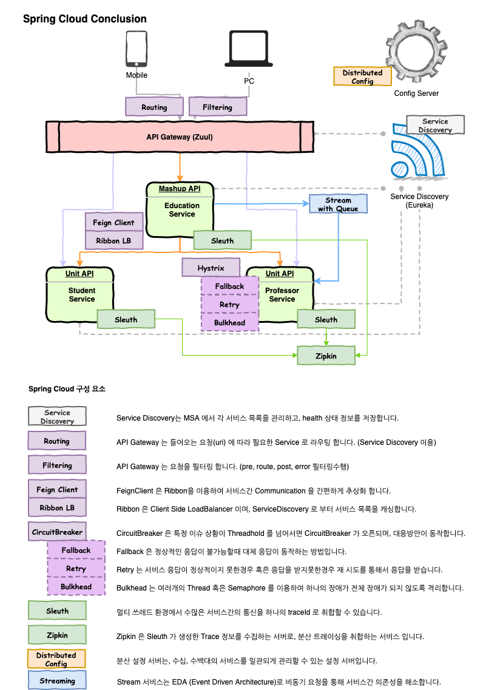
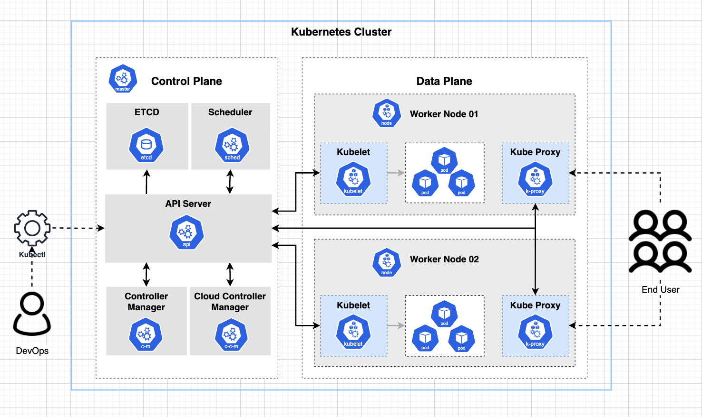

# Kubernetes Overview 

- 쿠버네티스는 강력한 open-source ochestration tool이다. 
- 구글이 만들어 오픈소스화 하였다. 
- 컨테이너화된 어플리케이션들로 구성된 마이크로 서비스를 관리하는 역할을 한다. 
- Kubernetes 는 REST API 와 선언적 매니페스트를 통해서 다양한 리소스를 관리하여, 복잡성을 클러스터 내부로 숨긴다.

## 기존 마이크로 아키텍처 시스템 

- 관리해야할게 너무 많다~ 
## Kubernetes Feature

### Automatic bin packing 

- Kubernetes에 컨테이너를 배포할때 각 컨테이너가 필요한 CPU, Memory 를 얼마나 사용할지 지정할 수 있다. 
- KUbernetes는 이러한 요청건에 대해서 자동으로 적절한 노드에 배포될 수 있도록 해준다. 

### Self Healling

- Kubernetes는 컨테이너가 다운되었을때 자동으로 재 시작 해준다. 
- 노드 자체가 다운된 경우에도 다른 노드로 컨테이너를 자동적으로 배포 할 수 있도록 해준다. 

### HPA 

- Horizontal Pod Autoscaling 
- 어플리케이션이 자동/수동적으로 메트릭을 확인하여 수평확장/축소 해준다. 

### Service Discovery and Load Balancing 

- 컨테이너는 자신의 고유 IP를 Kubernetes로 부터 할당 받는다. 
- 컨테이너들간에 리퀘스트를 분산할 수 있도록 컨테이너 셋을 단일 DNS에 등록하여 이를 이용한다. 

### Automatic rollbacks and rollout 

- Kubernetes 는 롤아웃, 롤백 을 수행할 수 있다. 
- 또한 어플리케이션이 다운되지 않도록 지속적으로 모니터링 하고, 만약 다운된다면, 롤백을 수행한다. 

### Secret and config management 

- Kubernetes 는 컨테이너 이미지로 부터 보안 부분을 분리 관리할 수 있도록 해준다. 
- 이는 매번 컨테이너가 리블드 하지 않도록 해준다. 

### Storage Ochestration

- Kubernetes 는 로컬 저장소, 원격 퍼블릭 저장소 등등의 다양한 저장소를 자동적으로 마운트 될 수 있도록 한다. 

### Batch execution 

- Kubernetes 는 오랫동안 수행되어야할 작업을 수행할 수 있도록 한다. 
- 또한 필요하다면 실패한 작업을 대체하고 다시 싫애시킬 수 있다. 

## Kubernetes Architecture Overview

- Kubernetes 를 활용하기 위해서 기본적인 Kubernetes Architecture를 살펴볼 필요가 있다.

### Kubernetes Cluster

- Kubernetes Cluster는 Kubernetes 를 운영하기 위한 여러 node들의 집합을 말한다. 
- Kubernetes Cluster 구성
  - Master Node (Control Plane): 쿠버네티스를 운영하는 구성요소들이 존재하는 장비를 마스터 노드라고 한다. 
  - Data Node (Data Plane): 실제 어플리케이션 서비스들이 실행되는 장비들을 데이터 노드들이라고 한다. 
- 클러스터 노드는 물리적 장비, 가상장비 (VM), 클라우드 인스턴스들이 될 수 있다. 

## Master Node (Control Plane)

- 마스터 노드는 Control Plane로 불린다. 
- Control Plane 구성 요소는 다음과 같다. 
  - API Server
  - ETCD
  - Scheduler
  - Controller Manager
  - Cloud Controller Manager 
- 마스터노드는 여러 컴포넌트및 노드들을 관리한다. 
  - 마스터 노드에 존재하는 Pod들 관리 
  - Data Node 관리 
  - Data Node의 Pod 관리 
- 마스터 노드역시 고 가용성을 위해 여러대의 노드로 구성된다. 
- 마스터 노드는 DevOps로 부터 오퍼레이션 요청을 받아 클러스터를 운영하고, 서비스 Pod등을 운영하게 된다. 
- 마스터 노드는 안정성을 위해 Control Plane 요소만 관리를 원칙으로 한다. 

## Data Nodes 

- 워커노드, 데이터노드 등으로 불린다. 
- 워커노드는 고 가용성을 위해 1대 이상의 장비로 구성된다. 
- 장비는 물리적 장비, 가상장비 (VM), 클라우드 인스턴스들이 될 수 있다. 
- 어플리케이션 (서비스) 들은 Data Node에 Pod라는 최소 단위로 배포가 된다. 
- Pod에는 하나 이상의 컨테이너가 배치 된다. 
- 시스템의 구모에 따라 Scale In/Out, Scale Up/Down 을 수행하여 오퍼레이션 할 수 있다. 

## Master Node 구성요소 

- 마스터 노드는 Kubernetes Cluster에서 두뇌를 담당한다. 
- 마스터 노드는 각 구성요소들을 활용하여 pod의 배치, 노드의 상태관리, 항상성 유지등을 수행한다. 

### API Server 

- API 서버는 Kubernetes를 운영하기 위한 API를 제공하는 서버이다. 
- 또한 모든 통신은 API 서버를 통해 이루어진다. 
- API 서버는 모든 클러스터 컴포넌트를 추적하고, 관리하는 역할을 한다. 
- 요청은 YAML/JSON 매니페스트를 이용한다. 

### ETCD 

- 분산, 고가용성 키-값 저장소이다. 
- 모든 쿠버네티스 클러스터 메타정보(클러스터 상태, 설정정보) 를 저장하고 관리한다. 
- 모든 클러스터의 정보는 ETCD에서 관리한다. (Source of truth)
- 오직 API 서버에서만 접근이 가능하다. 
- Control Plane 내부에 ETCD가 설치 될수도 있고, 외부 machine을 두어 분리 관리도 가능하다. 

### Scheduler

- POD를 어떤 노드에 배포되어야할지 스케줄 한다. 
- API 서버에 아직 할당되지 않은 POD를 검색하고, Node들의 상태를 감시하여 적절한 노드를 찾을 수 있도록 한다. 
- API 서버에 주기적으로 변경사항을 감시하는 일을 수행한다.
- 스케줄링 고려사항 :
  - 필요한 자원
  - 하드웨어/소프트웨어/정책 등 
  - Affinity, anti-affinity 
  - Data 위치 
  - 워크로드 사이에 간섭 여부 
  - Taint, Toleration
  
### Controller Manager 

- 컨테이너 객체의 상태를 감시한다. 
- API Server에 요청하여 해당 상태를 확인한다. 
- 컨테이너 객체가 요구한 상태인지 확인하고, 해당 상태가 될 수 있도록 조정작업을 한다. 
- yml파일이 변경되면 해당 변경사항에 따라 클러스터내 컨테이너를 관리한다. 
- 종류
  - Replication Controller: POD의 복제 수를 관리한다. 
  - Endpoint Controller: 서비스와 pod와 같은 엔드포인트를 배포한다. 

### Cloud Controller Manager 

- 클러스터 내부에서 클라우드 기술과 통합하는 역할을 한다. 
- 클러스터가 클라우드에서 동작한다면 Cloud Controller Manager이 사용된다. 
- CSP에 따라 다른 Cloud Controller Manager를 제공한다. 
- Cloud Controller Manager는 Cloud가 제공하는 API와 통신한다. 
  - 라우트, 로드밸런스, 볼륨등 클라우드 인프라 리소스와 연동하여 동작하도록 한다. 

## Data Node 

- 각 노드는 다양한 컴포넌트들이 수행되며, 실행중인 pod와 환경변수등을 제공한다. 

### Kubelet 

- 클러스터 Data Node 각각에 설치되어 있는 Agent이다. 
- API 서버에 Data Node 정보를 API 서버로 보낸다. 
- POD들의 실행상태를 체크한다. 
- POD의 인스턴스를 실행한다. 
- API 서버를 확인하고, 작업요청이 잇는경우 태스크 수행작업을 수행한다. 
- 마스터로 부터 지시를 받고, 메트릭을 반환한다. 

### kube-proxy

- 네트워크를 담당하며, 네트워킹의 핵심 임무를 수행한다. 
- IP 변환, 라우팅을 수행한다. 
- 클러스터 각 노드마다 수행되며 네트워크 프록시 역할을 한다. 
- 노드의 네트워크 룰을 관리한다. 이들은 Pod간 통신, 외부와의 통신을 수행한다. 
- 각 POD는 유니크한 IP 주소를 가지게 된다. 이를 통해서 POD와 통신이 가능하다. 
- 쿠버네티스 네트워킹 서비스를 촉진시키고 서비스에서 모든 파드사이에 로드밸런싱을 수행한다. 

### POD 

- 배포되는 최소단위이다. 
- POD에는 1개 이상의 컨테이너가 실행된다. 
- POD마다 고유의 IP를 가진다. 

## 기타 구성요소

- Registry 
  - 컨테이너 리포지토리로 이미지를 관리한다. 
  - Docker Hub, ECR, 자체관리 Repository 
- Networking
  - Cilium, Calico 프로젝트가 있다. 
- Telemetry
  - Prometheus와 Elastic Stack 와 같은 프로젝트를 이용할 수 있다.
- Security
  - LDAP, RBAC, SELinux, OAuth 를 포함하는 광범위한 옵션이 가능하다. 
- Package management
  - Helm 패키지 관리자를 통해서 어플리케이션을 패키지화 하고, 클러스터에 쉽게 배포할 수 있다. 
- Container Storage Interface (CSI)
  - Kubernetes 와 통합하여 저장소로 언티페이스 할 수 있는 표준 인터페이스 제공 
- Container Networking Interface (CNI)
  - Kubernetes cluster 에서 네트워킹 리소스 설정을 동적으로 수행할 수 있도록 한다. 
