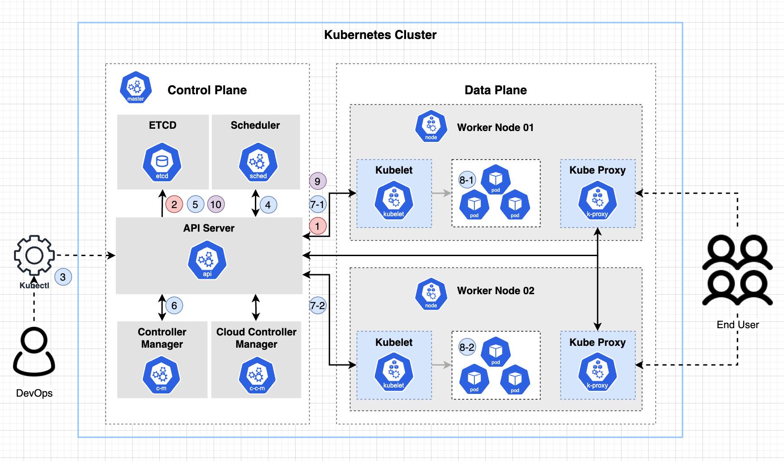

# Pod Deployment

- Kubernetes에서 Pod가 어떻게 배포 되는지 알아보자. 

1. Kubelet은 Node의 상태, 배포된 POD의 상태를 API Server로 전달한다. 
2. API 서버는 Kubenet으로 받은 Node의 상태를 ETCD에 저장한다. 
3. DevOps 담당자는 Kubectl을 이용하여 배포를 수행한다. (Deployment, Pod) 
   1. kubectl 은 제출된 작업을 API Server에 요청을 보낸다. 
4. Scheduler는 API 서버로 부터 새로운 작업이 들어왔음을 확인한다. 
5. 이때 ETCD를 통해서 스케줄링을 위한 클러스터 정보를 조회하여 스케줄링을 수행한다. (어떤 노드에 배포될지를 결정한다. )
6. Controller Manager 는 주기적으로 새로 배표되어야할 태스크를 API Server에서 확인하고, 대상 노드에 배포 요청을 한다. 
7. API Server는 배포 대상 노드의 Kubelet에 Pod 배포하라고 지시한다. 
8. Kubelet은 자신의 노드에서 Pod를 배포한다. 

