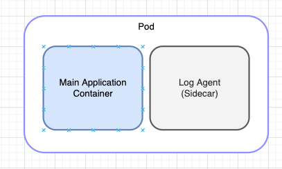
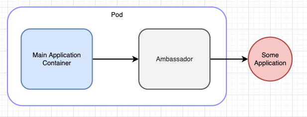
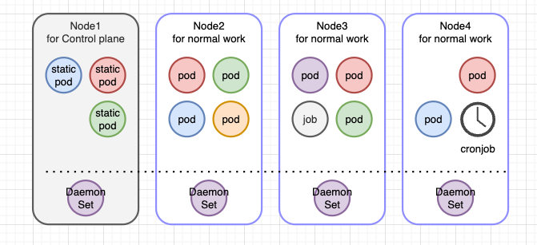

# Pods

- Kubernetes에서 Pod는 배포 최소 단위이다. 
- Pod는 컨테이너 1개를 지정할 수도 있으며, 여러개의 컨테이너를 지정할 수 있다. 

## Sidecar 패턴



- 위와 같이 메인 어플리케이션을 위한 Container
- 로그 Agent등과 같은 Sidecar Container 

## Ambassador 패턴 



- 메인 어플리케이션을 위한 Container 
- 외부와 통신, 외부의 요청등을 앞에서 대응하고, 어플리케이션으로 요청 전달하는 Ambassador Container

## 다양한 Pods 종류 



- Pod는 다양한 형태가 존재한다. 
  - 일반 Pod: 일반적인 어플리케이션이 컨테이너를 포함한다. Kubernetes의 Control Plane에서 관리 된다. 
  - Static Pod: etcd.yaml  kube-apiserver.yaml  kube-controller-manager.yaml  kube-scheduler.yaml 등과 같은 pod등 
  - job: 1회성 작업을 수행하는 Pod이다. 한번 수행하고 종료된다. 
  - Cron Job: Cron Tab처럼 주기적으로 Job이 수행된다. 

### 정적 Pod

- /etc/kubernetes/manifests 디렉토리에 pod definition 파일이 존재함 
- 정적 Pod 확인하기. 

```py
kubectl get pods --all-namespaces -o wide

NAMESPACE     NAME                                   READY   STATUS    RESTARTS   AGE   IP            NODE           NOMINATED NODE   READINESS GATES
kube-system   etcd-controlplane                      1/1     Running   0          13m   10.15.175.3   controlplane   <none>           <none>
kube-system   kube-apiserver-controlplane            1/1     Running   0          13m   10.15.175.3   controlplane   <none>           <none>
kube-system   kube-controller-manager-controlplane   1/1     Running   0          13m   10.15.175.3   controlplane   <none>           <none>
kube-system   kube-scheduler-controlplane            1/1     Running   0          13m   10.15.175.3   controlplane   <none>           <none>
... 생략
```

