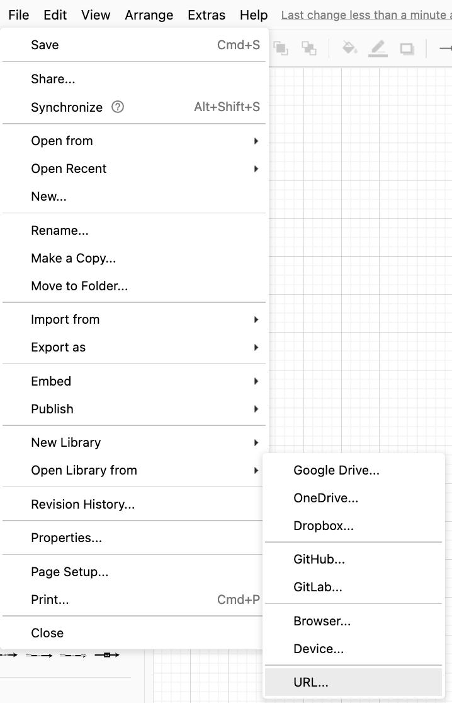
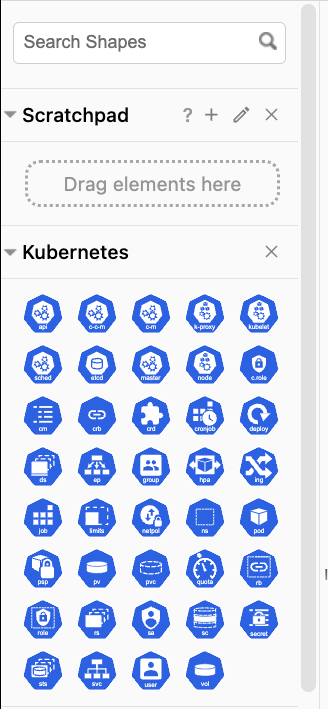

# Draw.io 에 kubernetes 아이콘 템플릿이용하기. 

- draw.io 는 무료로 다양한 다이어그램을 그리는 툴이다. 
- 깔끔한 인터페이스와 다양한 템플릿을 지원하여 여러 아키텍트들에게 많은 사랑을 받는 도구이다. 

## Kubernetes Template 추가하기. 

- 브라우저에서 https://draw.io 를 입력한다. 

## draw.io 다이어그램이 열리면 다음과 같이 메뉴를 찾아간다. 

- 상기 내역에서 File > Open Library from > URL 을 클릭한다. 

- 그리고 URL: 입력창에 아래 URL을 추가한다. 

https://jgraph.github.io/drawio-libs/libs/kubernetes.xml

- 좌측 아이콘 창에 kubernetes 아이콘이 로드된 것을 확인할 수 있다. 

## 이미지 관련 참고사항: 

- 자세한 아이콘 내역을 확인하고자 한다면 다음 경로를 찾아 확인하자. 

https://github.com/kubernetes/community/tree/master/icons

