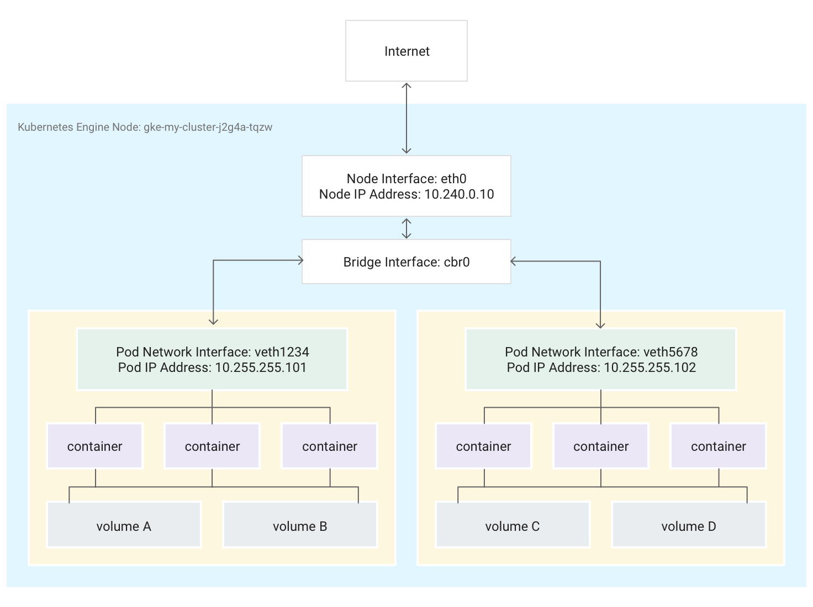
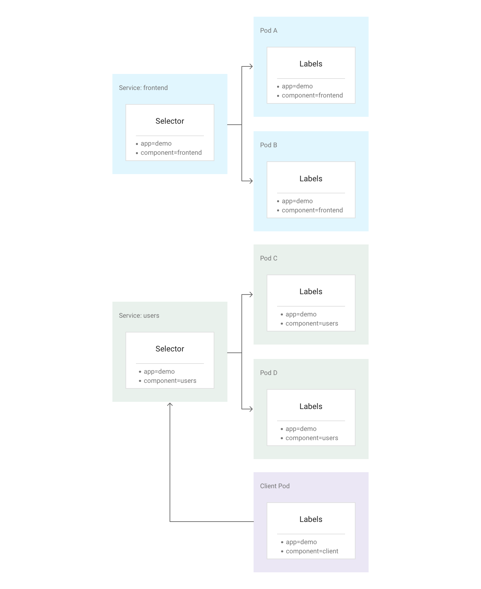
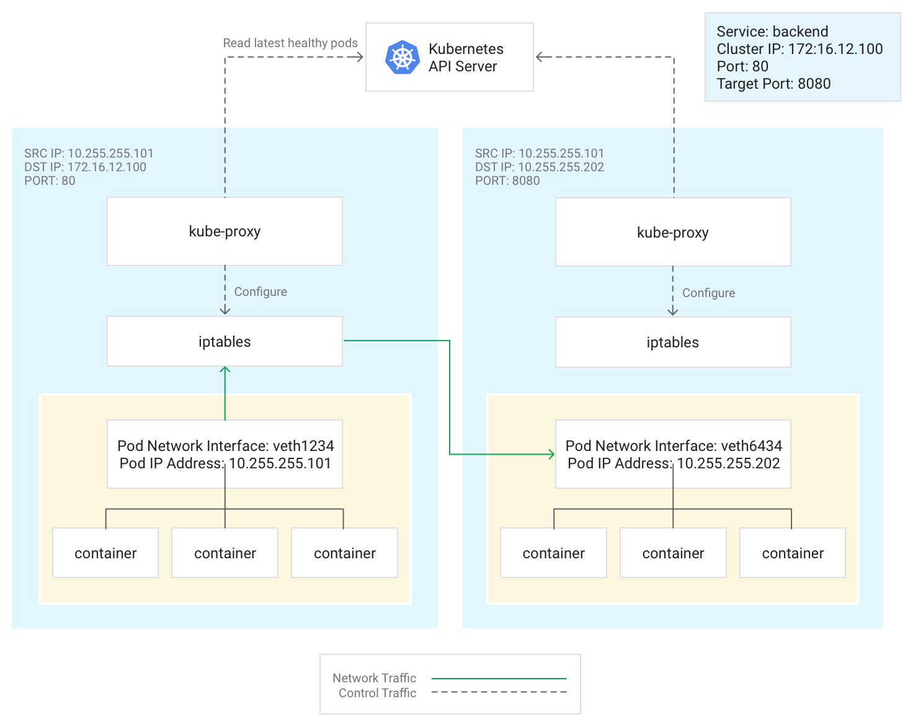

# Kubernetes Networking

from: https://cloud.google.com/kubernetes-engine/docs/concepts/network-overview?hl=ko

## 클러스터 내부 네트워킹

### POD내부 네트워킹 

- Pod내 여러 container가 존재
- Pod내에서는 localhost로 접근가능 

### Service 연동 

- Service에서 Selector을 통해서 Pod를 선택한다. 
- 선택된 Pod로 Service가 로드밸런싱 해준다. 

### Kube-proxy

- kube-proxy는 iptables를 생성한다. 
- 이 iptables를 통해서 pod사이의 커뮤니케이션을 수행한다. 
- kube-proxy는 외부와 연동할 수 있도록 해준다. 
- kubernetes api server와 함께 통신을 할 수 있도록 한다. 

# Ingress Controller 

from: https://banzaicloud.com/blog/k8s-ingress/

## Ingress Controller

## Simple Fanout

- URI 기반으로 트래픽 라우팅 
- 단일 엔드포인트를 이용하여 여러 백앤드 서비스를 제공할 수 있음 

## Host Based 

- 하나의 IP주소에 대해서 다른 호스트 이름에 대한 트래픽 처리, 하나의 로드 밸런서가 있는것 지원 

## TLS

- 443 포트로 제한되어 HTTPS 통신을 수행하도록 한다. tls.crt, tls.key 가 반드시 있어야한다. 
