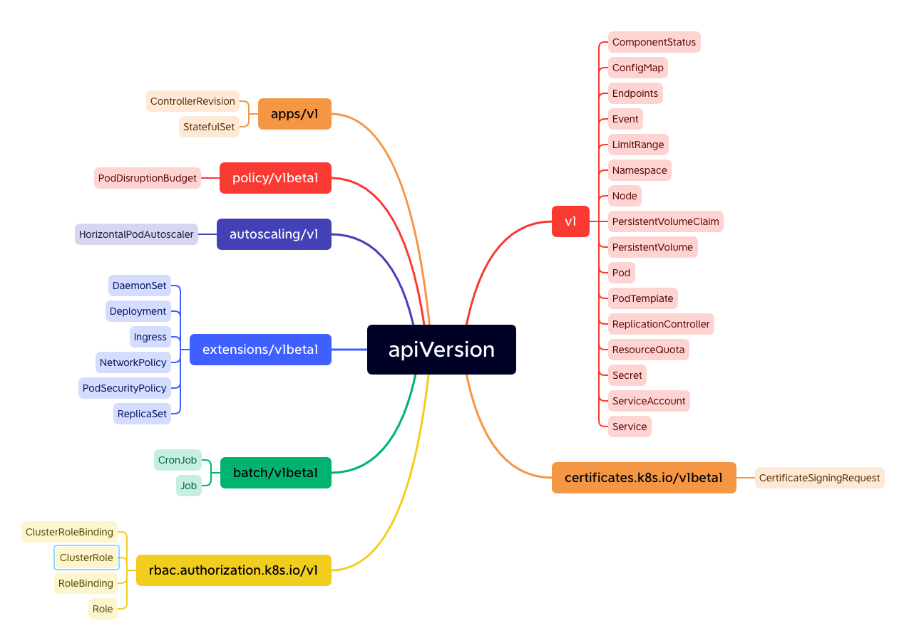

# Kubernetes apiVersion 알아보기

- kubernetes manifest 를 작성할때 구성은 다음과 같다. 

```yaml
apiVersion: 
kind:
metadata:
sepc:
```

- 위 내용과 같은 구조에서 apiVersion 을 통해서 생성하길 원하는 객체가 배포되는 버젼을 지정하게 된다. 

## Overview apiVersion



## apiVersion 릴리즈 버젼 

|releaseVersion|desc|
|---|---|
|alpha|Kubernetes에 앞으로 생성될 기능의 초기 후보를 의미한다. 버그를 포함할 수 있고| 작업을 보장하지는 않는다.|
|beta|알파를 통과한 기능이며 Kubernetes에 포함될 예정인 기능이라는 것을 의미한다.|
|stable|alpha나 beta등의 prefix가 붙지 않으며 안정화된 버젼의 기능을 의미한다.|

## apiVersion 그룹 알아보기 

|apiVersion|desc|
|---|---|
|v1|버젼1의 안정적으로 릴리즈된 기능이다. 대부분 핵심 객체가 여기 포함된다.|
|apps/v1|가장 공통적으로 사용하는 API그룹이며 Deployment/RollingUpdates/ReplicaSets 등과 같은 애플리케이션 실행과 관련된 기능을 포함한다.|
|autoscaling/v1|이 API버젼은 다양한 리소스 사용량 메트릭을 기반으로 POD 자동 확장/축소를 수행한다.|
|batch/v1|batch API그룹은 배치프로세싱과 job 과 같은 태스크를 수행하는 기능을 포함한다.|
|batch/v1beta1|배치 객체로 새롭게 릴리즈할 대상 기능이다. CronJob을 포함하며 이는 특정 주기로 Job을 수행한다.|
|certificates.k8s.io/v1beta|클러스터내 보안 커뮤니케이션에 대한 네트워크 인증 기능을 수행하며 새롭게 추가될 기능이다.|
|extensions/v1beta|이 버젼의 API에서 일반적으로 사용되는 많은 기능이 있다. Deployment/DaemonSets/ReplicaSets/Ingresses등과 같은 중요한 항목이포함된다. 대부분의 api들이 apps/v1과 같은 그룹으로 이동되었으며 1.6버젼 이상에서는 deprecated되었다.|
|policy/v1beta1|이 apiVersion은 pod보안에 관한 기능을 포함한다.|
|rbac.authorization.k8s.io/v1|이 apiVersion은 role-based access control 에 대한 추가 기능을 포함한다.|


참고: https://kubernetes.io/ko/docs/reference/using-api/