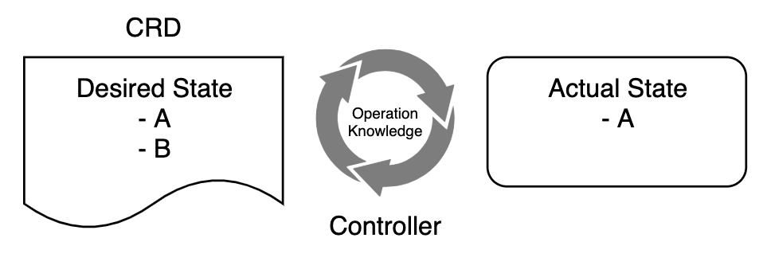

# Control Loop, Reconcile, Finalizer 이해하기

- Kuernetes 의 강력함은 선언적 방법으로 리소스를 선언한 상태로 유지하는 것이다. 
- 이러한 동작을 수행하는 객체가 Control loop 이다. 
- 운영자가 정의한 Desired State를 유지하는 작업을 Reconcile라고 한다. 



- 위 그림은 컨트롤 루프가 동작하면서 Desired Status로 유지하고 있다. 

## Reconcile 작업 내역 알아보기 


- 위 그림과 같은 단계로 Reconcile이 수행된다. 
- 위 내용을 하나한 알아보자. 

```go
1. CRD 인스턴스에 대한 이벤트가 발생된다. (생성/수정/삭제 요청)
2. CRD 인스턴스 객체를 Shared Index Informer 에서 조회한다. 
3. CRD 인스턴스가 생성되었는지 검사한다. 
  3.1 생성이 안된경우 (CRD 인스턴스 삭제 요청인경우)
    3.1.1 아무런 일도 일어나지 않는다. 
  3.2 생성이 된경우 (CRD 인스턴스의 생성, 수정 요청이 들어온경우)
    3.2.1 리소스를 생성한다. (config map, deployment 등의 작업)
    3.2.2 CRD 인스턴스를 생성된 컴포넌트의 소유자로 설정한다. 
    3.2.3 리소스를 배포한다. 
    3.2.4 리소스가 이미 존재하여 배포가 실패한경우
      3.2.4.1 아무일도 일어나지 않는다. 
    3.2.5 CRD 인스턴스 수정 요청인경우
      3.2.5.1 리소스를 업데이트 한다. 
```

- 위 작업이 Reconcile  작업이다. 
- 리소스에 대해서는 생성,수정,삭제 요청이 들어올 수 있으며, 기존 리소스의 상태를 확인하고, 해당 요청에 대한 처리를 수행한다. 
- 이러한 Reconcile 작업을 주기적으로 반복하는 것이 Control Loop가 수행하며, 리소스의 변경이 발생할때 마다 동작을 수행하는 주체가 Controller 이다. 

## Finalizer 

- Finalizer 는 리소스를 Kubernetes 클러스터에서 삭제한경우 동작하게 된다. 
- 리소스 삭제 요청이 들어온경우 리소스를 바로 삭제해 버리면, 예상치 못한 문제가 발생할 수 있다. 
- 특정 작업이 수행되고 있다면, 해당 작업이 완료되기 까지 기다린 후 리소스를 삭제해야한다. 
- 만약 연관된 다른 리소스가 존재한다고 한다면, 해당 연결을 종료한 후 리소스를 삭제해야한다. 
- 이러한 특정 조건이 완료되기 까지 대기한 후 리소스를 종료하는 역할을 하는 것이 Finalizer 이다. 

### Finalizer 동작 방식 

- manifest 파일을 이용하여 리소스를 생성할대, metadata.finalizers 필드를 이용하여 finalizer를 지정할 수 있다. 
- 리소스를 삭제하고자 할경우 API 서버가 finalizer 필드에 값을 확인하고, 다음을 수행한다. 
  - 삭제를 시작한 시간과 함께 metadata.deletionTimestamp 필드를 추가하도록 객체를 수정한다. 
  - metadata.finalizers 필드가 비어 있는 동안 객체가 삭제 되는것을 막는다.
  - 202 상태 코드를 반환한다. (HTTP 수락됨)

- Finalizer를 관리하는 컨트롤러는 객체 삭제가 요청되었음을 나타내는 metadata.deletionTimestamp 설정 개체에 대한 업데이트를 확인한다. 
- 그런 다음 컨트롤러는 해당 리소스에 대해 지정된 종료자의 요구 사항을 충족하려고 시도한다. 
- Finalizer 조건이 충족될 때마다 컨트롤러는 리소스의 종료자 필드에서 해당 키를 제거한다. 
- Finalizer 필드가 비어 있으면 삭제 타임스탬프 필드가 설정된 객체가 자동으로 삭제된다. 
- Finalizer를 사용하여 관리되지 않는 리소스의 삭제를 방지할 수도 있다. 

<br/>

- Finalizer의 공통적인 예제는 kubernetes.io/pv-protection 이다. 이는 PersistentVolume 객체의 우발적 삭제를 방지한다. 
- PersistentVolume 객체가 Pod에서 사용중인 경우 Kubernetes는 PV-Protection 종료자를 추가한다. 
- 만약 PersistentVolume 를 삭제하고자 하면, Terminating 상태로 들어간다. 그러나 finalizer 종료가 되지 않았으므로 바로 삭제가 되지 않는다. 
- Pod가 PersistentVolume 사용을 중지하는 경우 Kubernetes 는 pv-protection finalizer를 종료하고, 컨트롤러가 볼륨을 삭제하게 된다. 

## WrapUp

- 지금까지 Kubernetes에서 선언적 리소스의 상태를 어떻게 유지하는지 알아 보았다. 
- Control Loop 는 특정 리소스의 상태를 유지하기 위한 작업을 수행하는 역할을 한다. 
- Reconcile은 컨트롤 루프가 원하는 상태로 리소스를 변경하기 위한 조정 작업을 하는 조정 로직을 말한다. 
- Finalizer는 리소스가 삭제되어야할 때, 삭제 조건이 만족되는 경우에만 리소스를 안전하게 삭제하도록 하는 역할을 담당한다는 것을 이해할 수 있었다. 