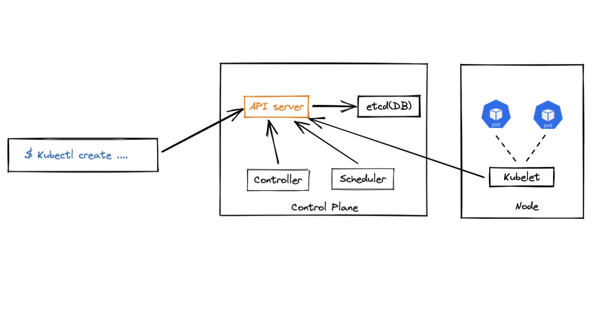
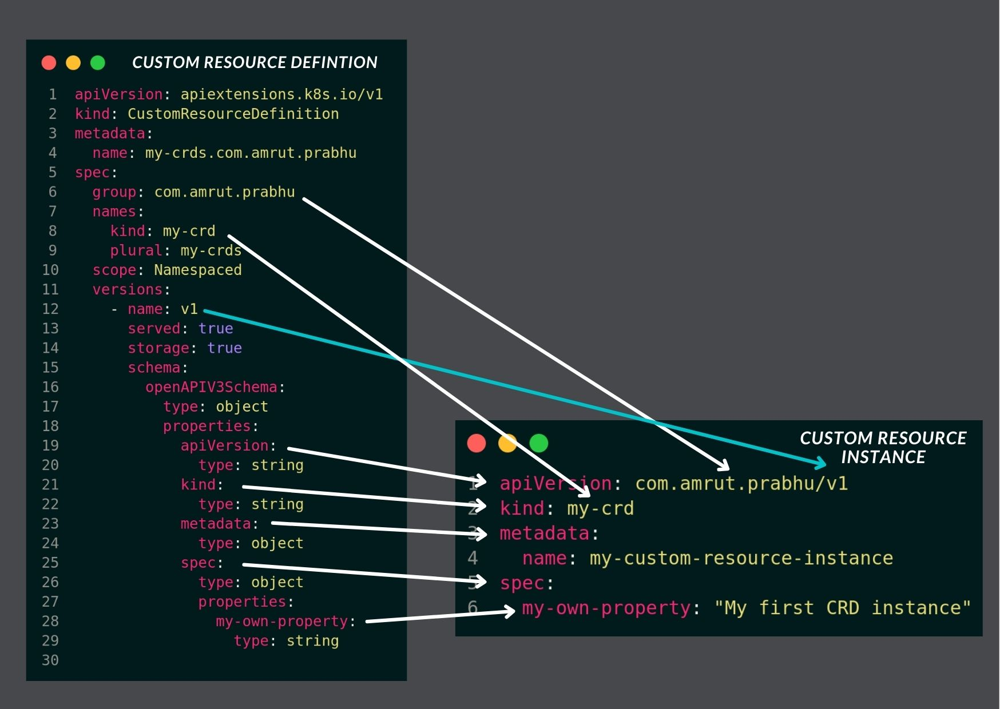
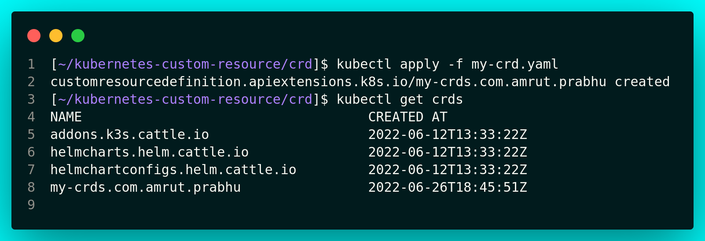
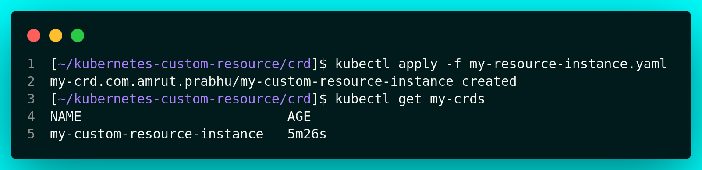

# How to Create a Kubernetes Custom Resource Definition (CRD)

from: https://refactorfirst.com/create-kubernetes-custom-resource-definition-crd

- 이것은 여러개의 아티클로, Kubernetes Custom Resource Definition (CRD) 와 Kubernetes Controller을 만들어 CRD 인스턴스의 생성 요청을 다루는 내용을 담고 있다. 
- 이 아티클에서는 Kubrernetes CRD를 생성하는 방법에 대해서 알아볼 것이다. 

## Kubernetes 에서 리소스가 어떻게 동작하는지 이해하기. 

- CRD와 컨트롤러를 생성하기 전에, Kubernetes 리소스가 관리되는 방법에 대해서 알아보자. 



- 보는바와 같이 API 서버, 스케줄러, 컨트롤러, 데이터베이스가 있다. 
- kubectl 명령어로 리소스를 생성할때, 실제적으로 API 서버와 통신한다. API 서버는 데이터베이스에 리소스를 저장한다. 
- 생성될 리소스가 있는지 API 서버에 계속 뭍는 스케줄러가 있다. 

- 생성될 pod를 스케줄러가 발견하면, API서버를 통해서 정보를 데이터베이스에 저장한다. 그리고 pod가 생성될 것이다. 

- 다음으로 kubelet은 각 워커노드에서 수행되고, API 서버에 요청을 시작한다. 그리고 특정 노드에 pod가 실행이 되었는지 체크한다. 
- Kubelet들은 컨트롤러 자체일 뿐이다. 

- 이 아티클에서 우리는 Kubernetes CRD를 생성하는지 볼 것이고, CRD의 인스턴스를 생성할 것이다. 

## 사전 준비

- 동작하는 kubernetes 클러스터 
  - 만약 없다면 로컬에 K3s 혹은 Kubernetes Cluster 류를 이용할 수 있다. 
  - https://k3s.io/
  - 다음과 같이 Kubernetes clsuter류에 대한 설치를 다음에서 찾을수있다. 
  - https://refactorfirst.com/kind-kubernetes-cluster
- kubectl 커맨드로 리소스를 생성, get, delete 의 동작에 대한 기본 지식

## Creating a Kubernetes Custom Resource Definition(CDR)

- 이제 단순 CRD를 생성하기 위한 부분을 살펴보자. 

```yaml
apiVersion: apiextensions.k8s.io/v1
kind: CustomResourceDefinition
metadata:
  name: my-crds.com.amrut.prabhu
spec:
  group: com.amrut.prabhu
  names:
    kind: my-crd
    plural: my-crds
  scope: Namespaced
  versions:
    - name: v1
      served: true
      storage: true
      schema:
        openAPIV3Schema:
          type: object
          properties:
            apiVersion:
              type: string
            kind:
              type: string
            metadata:
              type: object
            spec:
              type: object
              properties:
                my-own-property:
                  type: string

```

- 이것은 CRD를 위한 최소한의 설정이다. 
- 2가지 부분으로 내용을 확인하자. 
  - Part 1: 메타데이터 정의와 CRD의 정의
  - Part 2: CRD 인스턴스의 스키마 정의, 나중에 생성할 것이다 .

## Understanding The Kubernetes Custom Resource Definition Format

```yaml
apiVersion: apiextensions.k8s.io/v1
kind: CustomResourceDefinition
metadata:
  name: my-crds.com.amrut.prabhu
spec:
  group: com.amrut.prabhu
  names:
    kind: my-crd
    plural: my-crds
  scope: Namespaced
  versions:
    - name: v1
      served: true
      storage: true

```

- 위 내용은 우리의 리소스에 대한 "Kind" 를 정의한다. 우리는 CRD를 생성하고, 이름을 지정할 것이다. 
- 다음 형식으로 구성이 필요하다. 'CRD plural Name'.'Group Name' 형식이 필요하다. 
- 'my-crds.com.amrut.prabhu' 같은 형식이다. 
- spec 섹션에서 우리는 이름을 정의했다. kind의 복수 이름도 지정한다. 
- 이것은 타입으로 우리는 새로운 인스턴스를 나중에 생성할때 지정할 것이다. 

- 다음, 우리는 CRD 정의했고, scope 을 namespace로 지정했다. 그리고 버젼 섹션에서 CRD의 버젼을 v1으로 잡았다. 
- 이 정의에 대해서 새로운 버젼을 생성하길 원한다면, 단지 버전 번호만 바꾸면 될것이다. 

- 마지막으로 served 속성을 지정했고, 이 CRD는 클러스터에서 사용될 수 있고, storage 필드는 이 버젼의 CRD가 저장되는지 여부를 나타낸다. 
- 오직 하나의 버젼만 저장될 수 있다. 

### Understanding CRD Schema

```yaml
schema:
  openAPIV3Schema:
    type: object
    properties:
      apiVersion:
        type: string
      kind:
        type: string
      metadata:
        type: object
      spec:
        properties:
          my-own-property:
            type: string
        type: object
```

- 여기에서 우리는 Open API version 3 표준을 이용하여 스키마를 정의했다. 
- 일부 속성이 있는 객체로 최상위 레벨을 지정한다. 

- 이제 필수적인 속성중 몇가지를 알아보자. 
  - apiVersion
    - 사용될 CRD의 버젼을 정의한다. 
  - kind
    - CRD 의 타입
  - metadata  
    - metadata 는 이름, 어노테이션 등과 같은 값을 추가한다. 
    - 이것은 Object 유형이 될 것이다. 
  - spec
    - 제공하길 원하는 커스텀 지정 속성을 정의한다. 

- 이제 위 스키마에서 오직 하나의 속성을 지정했다. 
- spec 섹션에서 my-own-property 속성이 그 예이다. 자체 속성을 가진 객체 유형의 속성을 정의할 수 있다. 

- 다음 CRD가 어떻게 CRD 인스턴스와 매핑되는지 살펴보자. 



- 위 그림과 같이 화살표는 CRD와 CRD 인스턴스간의 매핑 관계를 잘 보여준다. 
- 어떻게 우리의 커스텀 리소스 정의가 실제 인스턴스의 YAML 파일에 매핑되는지 알 수 있다. 

- 이제 CRD를 kubernetes cluster에 어플라이 해보자. 

## Adding Kubernetes CRD to the Kubernetes Cluster

- CRD를 이용하기 위해서 Kubernetes Cluster에 추가해야한다. 
- 이제 다음 커맨드를 활용하여 등록하자. 

```go
kubectl apply -f my-crd.yaml
```



- CRD생성 이후로 우리는 첫번째 CRD 인스턴스를 생성할 것이다. 
- 우리는 동일한 인스턴스 YAML파일을 이용할 것이다. 

```yaml
apiVersion: com.amrut.prabhu/v1
kind: my-crd
metadata:
  name: my-custom-resource-instance
spec:
  my-own-property: 'My first CRD instance'
```



- 이제 방금 Kubernetes CRD를 생성했다. 그리고 첫번째 CRD 인스턴스를 생성했다. 
- 인스턴스를 생성하고 난후 어떠한 일도 일어나지 않는다. 
- 인스턴스 객체는 단지 생성만 되었고, Kubernetes database에 저장된 것이다. 
- 그러나 인스턴스가 생성될때 무언가를 수행하고 싶을 것이다. 
- 이를 위해서 우리는 컨트롤러를 구현해야한다. 이는 인스턴스 생성 요청을 다루고, 몇가지 일들을 할 수 있다. 
- 우리는 다음 아티클에서 내용을 더해 갈 것이다. 

- 이를 위해서 우리는 컨트롤러 생성이 필요하다. 이는 인스턴스 생성 요청을 처리하고, 이들과 함께 일을 수행한다. 
- 다음 아티클에서 살펴보자. 

- CRD yaml 파일을 github에서 확인할 수 있다. https://github.com/amrutprabhu/kubernetes-custom-resource/tree/main/crd


- 