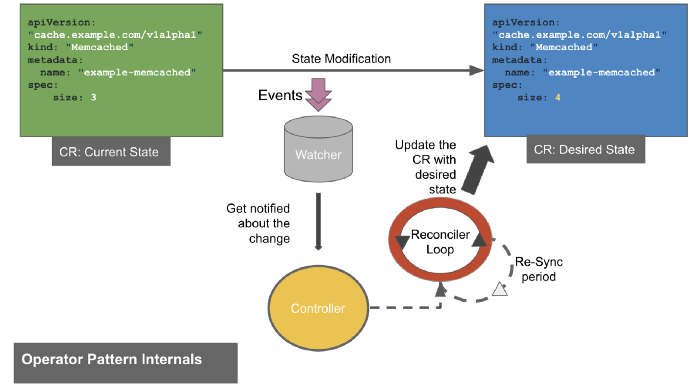
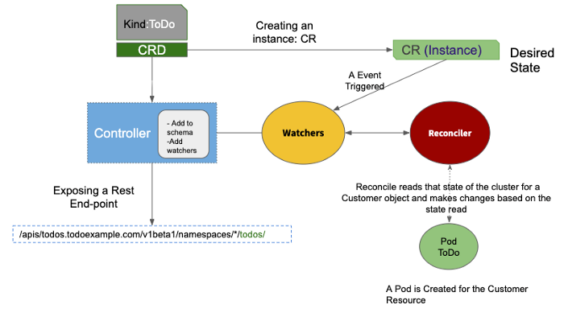

# Kubrernetes Operator

- Operator = Custom Resource Definition + Controller 
- 오퍼레이터 패턴 
  - 사람이 시스템을 모니터링하고, 안정적으로 운영 유지하기 위한 일련의 과정을 수행함
  - 오퍼레이터 패턴은 사람이 하는 이러한 행동을 자동화 하여 시스템이 수행하도록 위임하는 패턴

## Operator 3가지 활동

- 1. 관찰
  - 커스텀 리소스의 이벤트를 관찰한다. (생성, 수정, 삭제에 대한 업데이트를 상황을 관찰함)
- 2. 상태 분석
  - Desired State 와 Current State 를 분석
- 3. Reconcile or ACT
  - Desired State 대로 현재 State를 위해 작업을 처리한다. 

- 상기 모든 과정을 Operator Pattern으로 위임하면, 선언적 방법으로 Kubernetes 의 Resource를 관리할 수 있다. 

## 구성요소 및 동작과정 이해하기

from: https://medium.com/operators/operator-pattern-kubernetes-openshift-380ddc6a147c

- 구성요소:
  - 1. Controller
    - Custom Resource Definition 을 등록하고, API Schema 에 추가한다. 
    - CRD를 위한 end-point API 를 노출한다. 
    - watcher 를 통해서 리소스를 관찰한다. 
    - process/loop 를 수행한다. (예 Control Loop) 이를 통해 Desired로 상태를 변경한다. 
  - 2. Watcher
    - 특정 리소스 타입에 대한 이벤트를 감시한다. 
  - 3. Reconciler
    - reconciliation loop 를 통해서 변경사항을 원하는 상태로 변경처리한다. 
    - re-sync 주기마다 상태를 조정한다. 

### Desired state 로 변경하기 

from: https://medium.com/operators/operator-pattern-kubernetes-openshift-380ddc6a147c

- 1. CRD를 생성하고, Kubernetes Cluster에 등록한다.  (Create)
- 2. 등록 요청이 들어오면, Controller 이 스키마를 등록하고 Watcher를 기동한다. 그리고 REST API 를 외부로 노출한다. 
- 3. CR의 Desired state 에 대한 변경이 발생한다. (Update, Delete 등)
- 4. Watcher 는 변경 이벤트를 감지하고 Reconcile Loop는 Desired State로 리소스를 핸들링한다. 

## Kubernetes Operator의 이점

- 오퍼레이터는 쿠버네티스 API의 기능을 확장한다.
- 주요이점:
  - 1. 오퍼레이터를 통해 상태 비저장 어플리케이션 뿐만 아니라. 상태저장 어플리케이션에도 쿠버네티스 기능을 확장할 수 있다. 
    - 상태 저장 클라우드 애플리케이션과 서비스는 상태 비저장 애플리케이션과 서비스보다 관리하기가 훨씬 더 복잡하기 때문에 이것만으로도 중요한 이점이 있다.
    - 상태 저장 연산자에는 모니터링 솔루션용 Prometheus 오퍼레이터와 고가용성 PostgreSQL 데이터베이스 클러스터 관리용 Postgres 오퍼레이터가 있다. 
  - 2. 오퍼레이터는 수동 활동을 표준화 하고, 자동화에 대한 공통적이고 일관된 접근 방식을 만든다. 
  - 3. 오퍼레이터는 한 환경에서 다른 환경으로, 한 프로젝트에서 다른 프로젝트로 쉽게 이동할 수 있다. 
    - 다양한 프로젝트에 다운로드, 구성 및 사용할 수 있는 더 많은 일반 오퍼레이터가 있는 생태계의 출현을 가능하게 했다. 

- 오퍼레이터를 처음부터 만드는 것이 쉽지 않기 때문에 이 마지막 이점을 과소평가해서는 안된다. 
- 오퍼레이터를 위한 다양한 솔루션이 있다.

## 조립식 오퍼레이터와 커스텀 솔루션

- 오퍼레이터를 처음무터 생성하는 것은 매우 복잡하다. 
- 이는 프로그래밍 스킬이 필요하며 (GO가 선호된다 그러나 다른 언어로 클라이언트/서버 커뮤니케이션으로 구현할 수 있다.) 
- 그리고 쿠버네티스 네이티브 컨트롤러의 지식을 통해서 그리고 오퍼레이팅 메커니즘 (reconciliation loops)

- 그러나 다음과 같이 이러한 복잡성을 줄일 수 있는 프레임워크가 있다. 
  - Operator Framework: https://operatorframework.io/
  - Kubebuilder: https://kubebuilder.io/
  - Kubernetes Operators Framework: https://kopf.readthedocs.io/en/stable/

## Kubernetes Operator: 몇가지 예제

- 현재까지 기존 운영자를 쉽게 검색할 수 있는 두 가지 공식 애플리케이션이 있다. 
  - Artifact HUB: 
    - 오퍼레이터와 helm 차트를 모두 찾을 수 있는곳(CNCF 프로젝트)
    - https://artifacthub.io/packages/search
  - Operator Hub:
    - 오퍼레이터 전용 (Redhat 프로젝트)
    - https://operatorhub.io/
- 오퍼레이터를 통해 매우 다양한 문제에 대한 솔루션을 찾을 수 있다.

## WrapUp

- 지금까지 오퍼레이터의 개념을 알아 보았다.
- 오퍼레이터는 쿠버네티스 클러스터에 신규 리소스를 생성하고, 리소스의 상태 변경에 대한 조정 작업을 수행하는 역할을 한다. 
- 명령적 방법이 아닌 선언적 방법으로 커스텀 리소스의 상태를 유지하고, 동일한 패턴의 운영 업무를 오퍼레이터를 통해서 자동화 할 수 있게 된다는 것을 확인했다. 
- 오퍼레이터를 구성하는 다양한 툴에 대해서도 간단히 살펴 보았다.