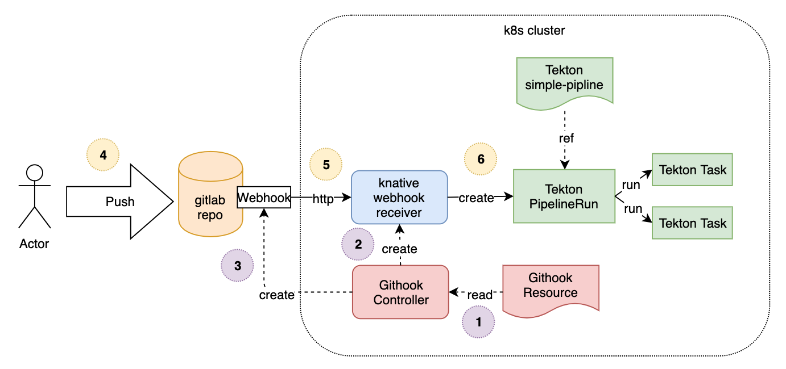

# Building your own kubernetes CRDs

- 우리의 쿠버네티스 CRD를 구축에 대한 지식을 공유한다. 
- Githook 예제를 이용하여 CRD를 개발하는 데 사용하는 단계를 설명한다. 
- https://gitlab.com/pongsatt/githook
- GIT 웹훅에서 클라우드 네이티브 CI/CD 빌드 파이프라인 빌드에서 이 CRD를 생성하는 이유에 대해서 설명한다. 

### 노트

- 이 아티클은 초급자를 위한 것이며, Kubernetes CRD 구축을 어떻게 하는지에 대해 배울 수 있다. 
- 목표는 CRD를 만드는 단계를 이해하는 것이며, knative와 같은 종속 항목이 설치되어 있으므로, 단계별로 따르지 못할 수도 있다. 

## 배울 수 있는것

- 쿠버네티스 CRD 개념
- 쿠버네티스 빌더와 golang을 이용하여 kubernetes CRD 를 어떻게 구축하는지

## CRD가 왜 필요한가?

- CRD는 Custom Resource Definition 을 가리킨다. 
- Pod나 Deployment와 같은 Kubernetes 리소스와 동일한 방식으로 작동하는 자체 Kubernetes 리소스를 만드는 방법이다. 
- Custom 리소스로 쿠버네티스 클러스터에 리소스를 어떻게 관리하는지 알려줄 수 있으며 이는 매우 강력한 방법이다. 

- 예를 들어 Strimzi는 쿠버네티스에서 카프카 클러스터를 수행하고 관리하기 위한 kubernetes CRD이다. 
- https://strimzi.io/
- Kafka 클러스터를 관리하는 지식을 CRD 컨트롤러 자체에 넣는 자체 Kafka 클러스터를 실행하는 많은 문제를 제거한다. 


- CRD 리소스를 관리하기 위해서 컨트롤러가 필요하다. (컨트롤러는 클러스터에서 수행되는 컨테이너이다.)
- 컨트롤러는 CRD에 설명된(원하는) 내용이 실제 세계의 실제 상태와 일치하는지 확인하기 위해 루프에서 실행된다. 
- 예를 들어 컨테이너 A와 B를 클러스터에서 수행하기를 원한다면 만약 A혹은 B 가 수행되지 않으면 컨틀롤러는 이를 생성한다. 

## Githook example CRD

- CRD는 "GitHook" 이라고 부른다. 
- 이는 git 웹훅 이벤트를 정의하고, 파이프라인을 구축한다. 
- GitHook 컨트롤러는 webhook 이벤트를 git repo에 구독하고 이벤트가 발생하면 CRD에 정의된 대로 빌드 파이프라인을 실행한다. 



- GitHook CRD 컨틀롤러의 잡은 다음과 같다. 
  - 웹훅이 git repo에 잘못된 정보로 저장되었는지 확인한다. 
  - 실행중인 서비스가 있는지 확인하고, 웹훅 이벤트를 기다린다. Kubernetes 서비스를 이용하여 웹훅을 수신하고, 구현하기 쉽고 사용하지 않는 경우 0으로 확장하기 때문에 이를 위해서는 knative 서비스를 사용한다. 

## Building CRD using kubebuilder

### 1. Setup

#### kubebuilder 과 kustomize 설치하기

- kubebuilder는 kubernetes CRD를 매우 빠르게 시작할 수 있는 툴이다. 
- 터스텀 타입과 컨트롤러 로직을 정의하는 것이 필요하다. 
- kustomize 는 kubebuilder 이 쿠버네티스에서 작업하기 위해 CRD가 필요로 하는 yaml 을 생성하는데 사용하는 도구이다. 
- 다음 설치 단계를 따라가지. https://book.kubebuilder.io/quick-start.html

#### project 설치하기

- 우리는 githook-tutorial로 이름지어진 go 프로젝트를 생성할 것이다. 이때 go 버젼이 1.11+ 이상이 필요하며, 폴더는 반드시 GOPATH 외부에 존재해야한다. 

```go
mkdir githook-tutorial
cd githook-tutorial

go mod init gitlab.com/pongsatt/githook

kubebuilder init --domain my.domain
```

- "gitlab.com/pongsatt/githook" 은 모듈 이름이다. 
- 만약 변경하고자 한다면 샘플코드에서 import 경로를 교체하는 것이 필요하다. 

- "my.domain" 은 리소스 API 의 경로가 될 것이다. 필요한경우 수정할 수 있다. 
  
#### custom resource 생성하기 

- 이 단계는 kubebuilder에 필요한 리소스 종류를 알려주는 것이다. 
- "GitHook" 을 tools라는 그룹에 리소스를 만들 것이다. 

```go
kubebuilder create api --group tools --version v1alpha1 --kind GitHook
```

- 완료가 되었다면 다음을 볼 수 있다. 

```go
- api
- bin
- config
- controllers
- githook-tutorial
- hack
- .gitignore
- Dockerfile
```

- 흥미로운 경로
  - api/
    - go 내부에 리소스 정보를 포함한다. 
  - config/
    - 모든 kubernetes yaml 파일들을 포함하며 컨트롤러에서 수행할때 필요한 파일이다. 
  - Makefile
    - 모든 스크립트를 포함하며 이는 CRD를 빌드하고 배포하기 위해 필요한 파일이다. 

## 2. Define resource type

- "api/v1alpha1/githook_types.go" 를 수정하여 터스텀 타입을 포함한다. 
- githook_types.go 파일을 확인하자. 
- https://gitlab.com/pongsatt/githook/blob/master/api/v1alpha1/githook_types.go

#### key notes:

- 만약 우리의 리소스를 yaml 을 통해서 생성하고자 할때 타입은 검증이 필요하다. 이때 해당 타입에 대한 커멘트를 넣을 필요가 있다. 
- 예를 들어 gitProvider를 gitlab, github 혹은 go에 추가가 필요하다. 

```go
// +kubebuilder:validation:Enum=gitlab;github;gogs

// GitProvider providers name of git provider
type GitProvider string
```

- 다음 스텝은 수행되는 커맨드에 의해 deepcopy 와 같은 유틸리티 함수를 생성하는 것이다. 

```go
make generate
```

## 3. Implement controller

- 이 포인트에서 우리는 터스텀 타입을 가지고 있으며 우리의 컨트롤러에 의해서 소비된다. 

#### 컨트롤러는 어떻게 동작하는가

- 우리의 컨트롤러는 "GitHookReconciler" 로 이름지어 져 있으며 메소드 이름은 "Reconcile"이다. 이는 매번 GitHook 리소스를 호출할 것이며 생성되고, 업데이트되고, 삭제된다. 
- 큐를 사용하여 각 이벤트를 순서대로 하나씩 처리한다. 
- 오류가 발생하면 현재 이벤트가 대기열에 추가되고 나중에 처리되기를 기다리도록 오류 상태를 반환한다. 

- 우리의 컨트롤러는 다른 2개의 리소스를 컨트롤 한다. 
  - Knative service(이는 발생된 git event 를 처리할 수 있다.)
  - Git webhook (git event들을 수신받을 수 있다.)
- Create/Upload Logic
  - GitHook 정보를 k8s client의 제공된 이름으로 가져온다. 

```go
// Reconcile main reconcile logic
func (r *GitHookReconciler) Reconcile(req ctrl.Request) (ctrl.Result, error) {
...
err := r.Get(context.Background(), req.NamespacedName, sourceOrg)

...
```

- 이 리소스에 의해서 생성된 Knarive 서비스를 획득한다. 
- 만약 존재하지 않는다면 새로 생성한다. 
- 존재한다면 정보가 업데이트 된다. 

```go
func (r *GitHookReconciler) reconcile(source *v1alpha1.GitHook) error {

...
ksvc, err := r.reconcileWebhookService(source)
...
```

- Knative service URL을 이용하여 git webhook 를 등록한다. 이는 이전 스텝에서 주어진 것이고, GitHook 리소스에서 반환된 아이디를 유지한다. 

```go
func (r *GitHookReconciler) reconcile(source *v1alpha1.GitHook) error {
...
hookID, err := r.reconcileWebhook(source, hookOptions)
...
```

- 최근 정보에 GitHook 리소스를 업데이트한다. 

```go
// Reconcile main reconcile logic
func (r *GitHookReconciler) Reconcile(req ctrl.Request) (ctrl.Result, error) {
...
if err := r.Update(context.Background(), source); err != nil {
    ....
}
...
```

#### Delete logic

- 만약 GitHook 리소스가 삭제를 받으면 "DeletionTimestamp"필드가 널인지 체크한다. 
- 그리고 의존성 리소스를 삭제할 것이다. 이 케이스에서 knative service와 git webhook 은 finalize 메소드에 의해서 호출된다. 

```go
// Reconcile main reconcile logic
func (r *GitHookReconciler) Reconcile(req ctrl.Request) (ctrl.Result, error) {
...
if sourceOrg.ObjectMeta.DeletionTimestamp == nil {
    ...
} else {
    if r.hasFinalizer(source.(*v1alpha1.GitHook).Finalizers) {
        reconcileErr = r.finalize(source.(*v1alpha1.GitHook))
    }
}
...
```

- 이 케이스에서 우리는 knative service 를 삭제할 수 없다. 우리는 GitHook 이 GitHook 리소스로 부터 finalizer 정보가 삭제되는 것으로 삭제되지 않는다. 

```go
func (r *GitHookReconciler) finalize(source *v1alpha1.GitHook) error {
    ...
    r.removeFinalizer(source)
}
```

#### Code

- "controllers/githook_controller.go" 파일을 수정한다. 
- 완료된 코드는 다음을 확인하자. https://gitlab.com/pongsatt/githook/blob/master/controllers/githook_controller.go

#### Key Notes

- 우리의 컨트롤러는 get, list, create, update 등 kubernetes resources 에 대한 퍼미션이 필요하다. 
- 커멘트 어노테이션을 kubebuilder에 대해서 추가가 필요하다. 이를 통해 yaml 퍼미션을 생성한다. 

```go
// +kubebuilder:rbac:groups=tools.pongzt.com,resources=githooks,verbs=get;list;watch;create;update;patch;delete
...
// Reconcile main reconcile logic
func (r *GitHookReconciler) Reconcile(req ctrl.Request) (ctrl.Result, error) {
...
```

## 4. Update manager

- 우리의 컨트롤러가 다른 리소스 api를 사용하는 동안 (knative와 같은것), 우리는 main.go 에 타입을 등록할 필요가 있다. 

```go
func init() {
    githookv1alpha1.AddToScheme(scheme)
    servingv1alpha1.AddToScheme(scheme)
    servingv1beta1.AddToScheme(scheme)
    tektonv1alpha1.AddToScheme(scheme)
    corev1.AddToScheme(scheme)
    // +kubebuilder:scaffold:scheme
}
```

## 5. Testing controller

- 컨트롤러를 이제 테스트하고 디버그 할 수 있다. 

```go
make install
make run
```

- make install
  - CRD yaml 파일을 생성할 것이다. 그리고 kubernetes 클러스터에 적용한다.
- make run
  - 테스트를 수행하고, main.go 파일을 실해한다. 

- 컨트롤러는 리소스를 모니터링 하기 시작할 것이고, reconcile 루프를 반복한다. 

## 6. Deploy CRDs and controller

- CRD가 클러스터에 사용할 수 있도록 할 필요가 있다. 
- 아래 디플로이 커맨드를 실행하자. 

```go
make docker-build IMG=<your image registry>/controller
make docker-push IMG=<your image registry>/controller 
make deploy
```

- make docker-bulid:
  - docker 이미지를 빌드한다. 이는 IMG 변수로 빌드한다. 
- make docker-push
  - 이미지를 레지스터리에 등록한다. 
- make deploy
  - yaml 파일을 생성하고, 클러스터에 배포한다. 

- 선택적으로 yaml 파일을 다른곳에 릴리즈 할 수 있다. 다음 커맨드를 이용하면 된다. 

```go
kustomize build config/default > release.yaml
```

## 결론

- 이 아티클에서, CRD를 빌드하기 위해서 중요한 포인트를 살펴보았다. 
