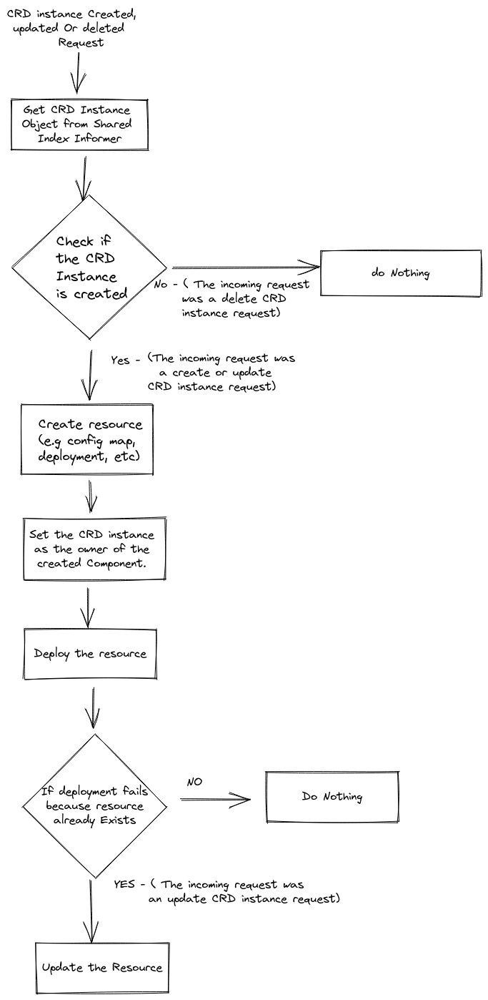

# How to Create a Spring Boot Kubernetes Controller

from: https://refactorfirst.com/create-kubernetes-custom-resource-definition-crd

- 이전 아티클에서 어떻게 Kubernetes Custom Resource Definition (CRD)를 생성하고, 클러스터에 배포하는지 살펴 보았다. 
- 이 아티클에서는 Kubernetes Controller 를 SpringBoot를 이용하여 생성할 것이다. 이는 CRD 인스턴스가 생성, 수정, 삭제되었을 때 처리를 수행한다. 

## 셋업

- https://start.spring.io 에서 새로운 프로젝트를 생성한다. 
  - Spring Starter Web 의존성만 선택한다. 

- 다음으로 Kubernetes 의존성 라이브러리를 다음과 같이 추가하자. 

```go
<dependency>
  <groupId>io.kubernetes</groupId>
  <artifactId>client-java-spring-integration</artifactId>
  <version>16.0.0</version>
</dependency>

```

## Java Model 클래스 생성하기 

- CRD와 함께 동작하게 하기 위해서, CRD를 자바 표현식으로 구성할 필요가 있다. 
- 우리는 배포된 CRD에서 클래스 파일을 생성할 것이다. 
- 이를 위해서 다음 커맨드로 docker 를 수행하자. 

```go
#!/usr/bin/env bash

LOCAL_MANIFEST_FILE=/home/amrut/projects/kubernetes-custom-resource/crd/my-crd.yaml
mkdir -p /tmp/java && cd /tmp/java
docker run \
  --rm \
  -v "$LOCAL_MANIFEST_FILE":"$LOCAL_MANIFEST_FILE" \
  -v /var/run/docker.sock:/var/run/docker.sock \
  -v "$(pwd)":"$(pwd)" \
  -ti \
  --network host \
  ghcr.io/kubernetes-client/java/crd-model-gen:v1.0.6 \
  /generate.sh \
  -u $LOCAL_MANIFEST_FILE \
  -n prabhu.amrut.com \
  -p com.amrut.prabhu \
  -o "$(pwd)"

```

- 위 코드는 다음과 같다. 
  - 첫번째 임시 디렉토리를 생성하여 생성된 클래스를 저장한다. 
  - 이는 [Kind Kubernetes Cluster](https://refactorfirst.com/kind-kubernetes-cluster) 를 Docker를 이용하여 시작한다. 
  - 그리고 임시디렉토리에서 배포된 CRD로 부터 Java 클래스 파일을 생성해낸다. 

- 중요노트: -n 플래그는 그룹 이름의 역순이어야 한다. 우리의 클래스에서 prabhu.amrut.com 은 com.amrut.prabhu 이어야한다. 
- https://github.com/kubernetes-client/java/blob/master/docs/generate-model-from-third-party-resources.md#example-commands-for-local-crd-manifests 를 참조하자. 

## Use Case 이해하기 

- 컨트롤러를 생성하기 전에 우리가 원하는 것이 무엇인지 알아보자. 
- CRD 인스턴스를 생성할때, 컨트롤러는 config map을 생성하길 원한다. 
- 만약 CRD 인스턴스가 수정되면, 컨트롤러는 config map을 업데이트한다. 
- 만약 삭제된다면 config map역시 삭제 된다. 

## Kubernetes Controller 생성하기

- 이제 컨트롤러를 생성하자. 우리는 몇가지 컴포넌트가 필요하다. 
  - A reconciler: 
    - 이 컴포넌트는 CRD 인스턴스의 변경이 발생했을때 처리를 담당한다. 
    - 이는 create, update, delete 를 CRD인스턴스에 가했을때 호출되며, 무언가 바뀐것에 대한 행위가 필요하다. 
  - A Shared Index Infomer:
    - 이것은 캐시위 유사하다. 
    - CRD 인스턴스의 생성, 수정, 삭제에 대해서, 컨트롤러는 지속적으로 Kubernetes cluster(API Server)에 요청할 필요가 없다. 
  - APIClinet
    - 쿠버네티스 클러스터(API Server)와 연결을 위한 클라이언트이다.
  - CRD Model
    - 이전에 생성한 모델 클래스이다. 

- 이제 첫번재 컴포넌트를 생성하자. 이는 shared index informer이다. 

```go
@Bean
SharedIndexInformer<V1MyCrd> sharedIndexInformer(SharedInformerFactory sharedInformerFactory, ApiClient apiClient) {
    GenericKubernetesApi<V1MyCrd, V1MyCrdList> api = new GenericKubernetesApi<>(V1MyCrd.class,
            V1MyCrdList.class,
            "com.amrut.prabhu",
            "v1",
            "my-crds",
            apiClient);
    return sharedInformerFactory.sharedIndexInformerFor(api, V1MyCrd.class, 0);
}
```

- 여기서 우리는 index informer 를 생성했다. 이는 APIClient의 참조를 가질 것이며, CRD의 인스턴스가 생성되었는지 감시한다. 

### Reconciler Component 이해하기

- 이제 reconciler에서 어떤일을 해야하는지 이해해보자.



- 위 내용은 아주 단순한 알고리즘이다. 
- 플로우차트에서 보듯이 3개의 다양한 요청이 있다. Create, Update, Delete가 그것이다. 
  - Create Instance Request
    - 요청을 받으면, 이루닌 index informer에서 리소스 인스턴스의 참조를 획득한ㄷ.ㅏ 
    - 그리고 config map를 생성하는 등의 작업을 수행할 수 있다. 
    - 이제 새로운 리소스가 CRD instance 생성으로 생성되었다면 우리는 현재 CRD 인스턴스를 새로운 리소스 소유자로 설정해야한다. 
    - 왜인지는 곳 알게 된다. 
  - Update Instance Request
    - 이 아티클에서 우리는 수정된 CRD 인스턴스의 참조를 획득했다. 
    - 그리고 컴포넌트상의 수정을 수행한다. 
    - 예를 들어 이전에 생성된 config map를 수정하는 것이다. 
  - Delete Instance Request
    - 이번에는 어떤일도 할 필요가 없다. 
    - 곧 우리는 CRD 인스턴스를 삭제할 것이다. 
    - Kubernetes는 자동적으로 모든 소유된 리소스를 삭제한다. 
    - 이것은 우리가 왜 리소스가 새로 생성될대 소유권을 설정해야하는지에 대한 이유가 된다. 

### Reconciler Component 구현하기

- 2개의 파트로 Reconciler를 살펴보자. 

```java
request -> {
    String key = request.getNamespace() + "/" + request.getName();

    V1MyCrd resourceInstance = shareIndexInformer
            .getIndexer()
            .getByKey(key);

    if (resourceInstance != null) {

        V1ConfigMap v1ConfigMap = createConfigMap(resourceInstance);

        try {
            coreV1Api.createNamespacedConfigMap(request.getNamespace(),
                    v1ConfigMap,
                    "true",
                    null,
                    "",
                    "");
        } catch (ApiException e) {
```

- 여기에서 들어오는 요청에는 생성된 리소스의 이름과 네임스페이스만 포함되어 있다. 
- 그리고 Shared index former 를 이용하여 CRD 인스턴스의 참조를 획득한다. 
- 만약 인스턴스가 생성되어 있다면 우리는 참조를 획득한다. 
- 그렇지 않으면 인스턴스가 삭제된 것이다. 
- 일단 참조를 획득하고 나면, CoreAPI를 이용하여 Kubernetes config map을 생성한다. 

- 다음은 configmap 생성 함수이다. 

```java
private V1ConfigMap createConfigMap(V1MyCrd resourceInstance) {
    return new V1ConfigMap()
            .metadata(new V1ObjectMeta()
                    .name("my-config-map")
                    .addOwnerReferencesItem(new V1OwnerReference()
                            .apiVersion(resourceInstance.getApiVersion())
                            .kind(resourceInstance.getKind())
                            .name(resourceInstance.getMetadata().getName())
                            .uid(resourceInstance.getMetadata().getUid())))
            .data(Map._of_("amrut", "prabhu"));
}
```

- 새로운 configmap 객체를 생성하고, 현재 CRD 인스턴스의 참조를 설정한다. 
- 이는 config map의 주인으로 동작한다. 

- 이제 업데이트동안 무슨일이 생기는지 알아보자. 

```java
} catch (ApiException e) {
    System._out_.println(e);
    if (e.getCode() == 409) {
        try {
            coreV1Api.replaceNamespacedConfigMap("my-config-map",
                    request.getNamespace(),
                    v1ConfigMap,
                    "true",
                    null,
                    "",
                    "");
        } catch (ApiException ex) {
            throw new RuntimeException(ex);
        }
    } else {
        throw new RuntimeException(e);
    }
}
```

- 만약 업데이트를 수신하면, index informer는 수정된 CRD 인스턴스의 참조를 반환한다. 
- 우리는 여전히 생성/수정에 대한 요청이 들어왔는지 알 수 없다. 

- 그래서 우리는 리소스가 이미 생성되었음을 의미하는 409와 함께 예외를 발생시켜 실패하는 일반적인 생성 접근방식을 진행한다. 
- 그런다음 현재 요청이 업데이트임을 알고 config map을 업데이트한다. 

- 삭제의 경우 우리는 아무것도 할 필요가 없다. 
- Kubernetes는 CRD인스턴스가 소유한 모든 리소스를 자동으로 삭젷나다. 

- 이는 왜 CRD 생성 요청을 처리하면서 생성한 모든 리소스의 소유자로 CRD 인스턴스를 설정해야하는지에 대한 이유이다. 


## Conclusion

- 스프링 부트로 Kubernetes controller를 생성했다. 그리고 Kubernetes의 CRD instance를 생성, 수정, 삭제시 처리방법을 알아 보았다. 
- https://github.com/amrutprabhu/kubernetes-custom-resource 에서 소스 참조하기 


