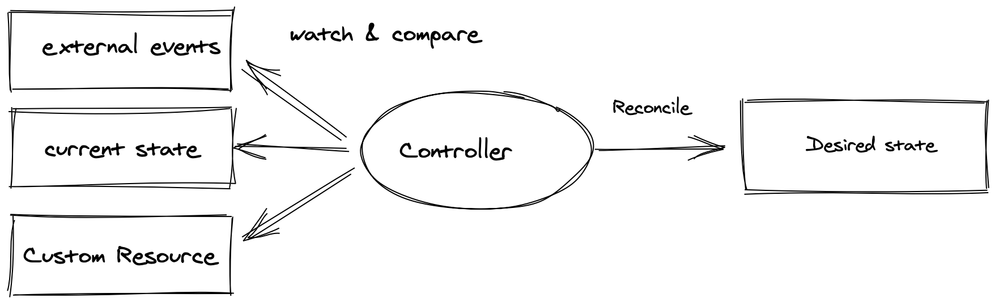

# Operator White Paper

- 어플리케이션 인프라 관리에는 많은 반복적인 인간의 노력이 필요하다. 
- 오퍼레이터는 필요한 활동을 캡슐화 하고, 어플리케이션의 상태, 관리에 대한 체크를 수행한다. 

- 쿠버네티스 오퍼레이터는 영리하고, 동적으로 API의 기능을 확장하여 관리기능을 제공한다. 

## Operator Design Pattern

- Kubernetes Operator Definition은 쿠버네티스 객체와 개념에 대한 구현을 묘사한다. 
- 오퍼레이터 디자인 패턴은 도메인별 지식 및 선언적 상태를 사용하여 애플리케이션 및 인프라 리소스를 관리하는 방법을 정의한다. 
- 이러한 패턴의 목적은 수동으로 명령형 작업을 줄인다. (백업, 확장, 업그레이드등.) 
- 이것은 어플리케이션을 안정적으로 유지하고, 상태를 잘 관리하도록 한다. 이는 선언적 API를 이용하여 도메인 정의 시직 캡쳐링을 한다. 

- 오퍼레이터 패턴을 이용하여, 리소스를 조정하고 유지 관리하는 방법에 대한 지식이 코드로 캡쳐되고 종종 단일 서비스 내에서 캦쳐된다. 

- 오퍼레이터 패턴을 이용하기 위해서 사용자는 원하는 어플리케이션의 상태를 지정하기만 하면 된다. 
- 오퍼레이터는 원하는 상태가 될 수 있도록 변경에 대한 작업을 수행한다. 
- 오퍼레이터는 또한 지속적으로 실제 상태를 모니터하고, 동일한 상태가 되도록 유지한다. 


- 오퍼레이터 패턴은 3개의 컴포넌트로 구성되어 있다. 
  - 어플리케이션 혹은 인프라를 관리하기를 원한다. 
  - 도메인 지정 언어는 사용자가 어플리케이션을 원하는 상태로 유지하기 위해서 선언적 방법으로 구성한다. 
  - 컨트롤러는 지속적으로 수행된다. 
    - 상태를 읽고 인식한다. 
    - 자동화된 방법으로 어플리케이션에 대한 액션 수행
    - 선언적 방법으로 어플리케이션의 상태를 리포트한다. 

## 오퍼레이터 특성

- 동적 설정
  - 일반적 설정(파일, 환경변수)
  - 동적 설정 API 에 쿼리하여 어플리케이션이 기동될때 설정 적용 
- 운영 자동화
  - 클러스터된 소프트웨어 배포, 자동화된 백업 및 복원 제공, 부하 기반 동적 확장과 같은 더 높은 수준 자동화
- 도메인 지식
  - 어플리케이션 업그레이드, 오류수정 등을 수행할때 전문화된 도메인 지식을 자동화 한다. 

## 쿠버네티스에서 오퍼레이터 컴포넌트



- 쿠버네티스 컨트롤러
  - 컨트롤러는 원하는 상태를 실제 상태와 비교하여 상태를 원하는 상태로 맞추는 작업을 수행한다. 
  - 오퍼레이터와 컨트롤러는 사실상 다를것이 없다. 
  - 단지 차이라고 한다면 오퍼레이터에는 운영을 위한 지식이 포함되어 있다는 것
- 커스텀 리소스, 커스텀 리소스 정의
  - 커스텀 리소스는 쿠버네티스에서 제공하는 API를 통해서 구조적데이터를 저장하고, 조회하는 역할을 한다. 
  - 오퍼레이터 입장에서 커스텀 리소스는 원하는 상태를 지니고 있다. 그러나 커스텀 리소스는 해당 로직을 가지고 있지는 않다. 
  - CR: 쿠버네티스 리소스를 이야기한다. 
  - CRD: 리소스가 어떻게 정의되었는지 모양을 설명한다. 

```yaml
apiVersion: example-app.appdelivery.cncf.io/v1alpha1
kind: ExampleApp
metadata:
  name: appdelivery-example-app
spec:
  appVersion: 0.0.1
  features:
    exampleFeature1: true
    exampleFeature2: false
  backup:
    enabled: true
    storageType: “s3”
    host: “my-backup.example.com”
    bucketName: “example-backup”
status:
  currentVersion: 0.0.1
  url: https://myloadbalancer/exampleapp/
  authSecretName: appdelivery-example-app-auth
  backup:
    lastBackupTime: 12:00
```

- 컨트롤 루프
  - 컨틀롤 루프 (reconciliation) 는 사용자가 CRD 를 이용하여 어플리케이션의 상태를 확인하고, 조정하는 역할을 한다. 
  - 의도와, 실제 동작의 매치를 수행한다. 

## 오퍼레이터 기능

- 어플리케이션 설치 / 어플리케이션 오너쉽 획득
  - 필요한 리소스에 대한 설정과 프로비저닝 제공
  - 설치동안 손으로 작업할 일이 없게 된다. 
  - 오너쉽은 오퍼레이터가 리소스의 이전을 쉽게 수행할 수 있도록 하는데 목적이 있다. 
- 어플리케이션 업그레이드
  - 오퍼레이터는 어플리케이션/리소스의 버젼을 업그레이드 할 수 있다. 
  - 오퍼레이터는 필요한 의존성, 커스텀 커맨드 등을 수행한다. 
  - 문제가 발생하면 업데이트 하거나 롤백을 수행하게 된다. 
- 백업
  - 지속적인 백업을 생성하도록 해준다.


- 백업으로 복구
  - 사용자가 성공적인 백업에서 애플리케이션 상태를 복원하는데 수행
  - 어플리케이션의 현재 상태를 백업 --> 어플리케이션의 커스텀 리소스 생성, 백업 포인트 지정, 이후 버젼과 데이터를 복구함
- 자동 개선
  - 복잡한 실패 상태에서 애플리케이션을 복원하도록 한다. 
  - 헬스체크 등과 같은 기능을 확장해서 더 깊이 있는 어플리케이션 상태를 검사하고, 자동 교정 수행
- 모니터링/메트릭 - 가시성
- 스케일링 (오퍼레이터는 스케일링을 지원한다.)
- 자동 확장
- 자동 설정 튜닝
- 언인스톨/연결해제

## 보안

### 오퍼레이터 개발자

- 투명성과 문서화
- 오퍼레이터 스콥
  - 클러스터 영역 오퍼레이터
  - 네임스페이스 영역 오퍼레이터
  - 외부 오퍼레이터
- 취약점 분석

### 어플리케이션 개발자 (Operator 사용자)

- Namespace
- Role-Based Access Controls
- Software provenance
- Advanced Security controls
- 오퍼레이터 설정

## 오퍼레이터 프레임워크

- CNCF Operator Framework
- Kopf
- kubebuilder
- Metacontroller - Lightweight Kubernetes controllers as a service

## 오퍼레이터 라이프사이클 관리자

- 오퍼레이터 업그레이드
- 선언적 상태 업그레이드
- 
## Prometheus Operator

## GitOps에 대한 오퍼레이터

## Best Practices

- 단일 타입의 어플리케이션 관리
- 오퍼레이터 작성 (전체 스택 표시)
- 컨트롤러당 하나의 CRD
- 퍼블리시와 오퍼레이터 찾기
