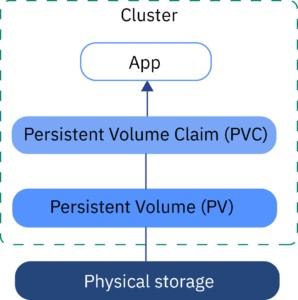

# Kubernetes Storage

- Kubernetes 저장 공간은 쿠버네티스 어플리케이션이 스토리지를 요청하고 사용할 수 있는 방법을 제공한다. 
- Pod는 컨테이너가 종료되면 컨테이너 내부의 데이터는 사라진다. 이 데이터를 영속적으로 보관할 수 있는 방법이 필요하며 이때 Persistent Volume에 저장할 수 있다. 



## Persistent Volume (PV)

- 클러스터 레벨의 리소스이다. 
- 클러스터 관리자 혹은 외부 프로비저너에 의해서 생성되거나, 스토리지 클래스를 사용하여 동적으로 프로비저닝 된다.
- 노드가 클러스터 리소스인 것처럼 클러스터의 리소스이다. 
- PV는 Volumes와 같은 볼륨 플러그인이지만 PV를 사용하는 개별 Pod와 독립적인 수명 주기를 갖는다. 


## Persistent Volume Claim (PVC)

- 사용자에 의해서 스토리지를 요청한다.
- 이는 Pod와 유사하다. 
- Pod는 노드 리소스를 사용하고 PVC는 PV 리소스를 사용한다. 
- Pod는 특정 수준의 리소스(CPU 및 메모리)를 요청할 수 있다. 
- 클레임은 특정 크기 및 액세스 모드를 요청할 수 있다. 

## Storage Class

- 스토리지 클래스 객체를 사용하면 클러스터 관리자가 성능, 크기 또는 액세스 아규먼트와 같은 다양한 속성으로 PV를 정의할 수 있다. 
- 이를 통해서 스토리지 구현의 세부사항을 추상화 하면서 저장소를 사용자에게 노출할 수 있다. 
- Kubernetes에는 미리 정의된 많은 Storage Class가 있으며, 직접 만들 수 있다. 
- 

## PV 라이프사이클 

- PV는 클러스터 리소스이며, PVC를 통해서 PV 리소스를 요청할 수 있다. 
- 이는 프로비저닝을 수행하고, 바인딩, 사용, 재요청 의 과정의 라이프사이클을 가진다. 

### 프로비저닝 

- 프로비저닝은 스토리지를 생성하는 과정을 말한다. 
- 2가지 프로비저닝이 있다. 
  - 정적 프로비저닝: 
    - 클러스터 관리자에 의해서 PV를 생성하는 과정이다. 
    - PV는 쿠버네티스 API에 위치되며, 클러스터 사용자가 사용할 수 있는 스토리지 리소스에 대한 정보를 포함한다. 
  - 동적 프로비저닝:
    - PVC 요청에 대해서 클러스터는 볼륨을 동적으로 생성한다. 
    - 이는 일반적으로 사용가능한 정적 PV가 PVC와 일치하지 않을때 발생한다. 
    - 클러스터는 기본적으로 StorageClasses를 이용하기 위해서 선택적으로 설정될 수 있다. 

### 바인딩 

- 바인딩은 PV와 PVC가 서로 연결되는 것이다. 
- 이는 다음 과정으로 수행된다. 
  - 사용자가 스토리지의 특정 양과 접근 모드를 요청한다. 
  - 컨트롤 루프는 새로운 PVC를 확인하고 다음 과정을 수행한다. 
    - 정적: 매치되는 정적 PV를 찾는경우 PVC와 바인딩 한다. 
    - 동적: 매치되는 PV가 없을때 PVC에 대해 동적으로 프로비저닝 한다. 
  - 이후 PV와 PVC가 바인딩 (연결) 된다. 
- PV와 PVC 바인딩은 1:1 매핑이다. 

#### 바인딩 상태 

- Available: 사용가능한 상태이다. 바인딩은 아직 이루어지지 않았다. 
- Bound: PV가 PersistentVolumeClaim 과 매치되었고, 바인딩이 수행되었다. 
- Released: 사용자는 자신의 PVC를 삭제한다. 그러나 클러스터에 의해서 재요청 되지는 않았다. 
- Failed: PV는 자동적으로 클러스터에 의해서 재요청 될 수 없다. 

### 사용 

- POD는 볼룸으로 클레임을 이용한다. 다음과 같이 동작한다. 
  - 클러스터는 바운드할 볼룸을 찾기위해 클레임한다. 그리고 볼륨을 바운드한다. 
  - 복수 access 모드를 지원하며 이를 사용하면 사용자는 요구된 모드로 접근할 수 있다.
  - 일단 사용자가 볼륨을 프로비져닝 된이후 바운드된 PV는 사용자의 소유가 된다. 
- 사용자들은 Pod를 스케줄 할수 있고, 클레임된 pv에 접근한다. 
- 이때 volumes 블록에 PersistentVolumeClaim 섹션에 기술된 pv를 이용한다. 

#### Access Mode

- Pod가 볼륨에 접근할때 어떠한 모드로 접근할지를 알려준다. 
  - ReadWriteOnce: 오직 마운트된 하나의 노드에서만 읽기 쓰기를 수행할 수 있게 한다. 
  - ReadOnlyMany: 오직 읽기만 가능하며, 여러 노드에 마운트 되어 한꺼번에 접근할 수 있다. 순간 동시에 접근은 불가능하다. 
  - ReadWriteMany: 읽기 쓰기를 지원하며 여러 노드에 마운트 되어 읽기/쓰기를 할 수 있게 해준다. 

## 리클레임 (재요청)

- 리클레임은 클러스터에 볼륨이 릴리즈 되고 난 이후에 어떻게 할지를 알려주는 것이다. 
- 이때 Retained, Recycled, Deleted 의 3가지 옵션이 있다. 
  - Retained: 명시적으로 삭제하지 않는 이상 그대로 PV를 유지한다.
  - Recycled: 데이터를 삭제하며, 나중에 복구 될 수 있다. 
  - Deleted: 되돌릴수 없게 삭제한다. 

## 정적/동적 프로비저닝 


- 정적 프로비저닝
  - 상단 화면과 같이 PVC 요청을 수행하면 매치되는 PV를 검색한다. 
  - 매치되는 PV를 발견하면 바인딩을 수행하고 사용할 수 있도록 한다. 
- 동적 프로비저닝 
  - 하단 화면과 같이 PVC 요청을 수행하고 매치되는 PV를 찾지 못한경우 수행
  - 스토리지 클래스에서 PV를 신규 생성한다. 
  - 이후 PV와 PVC를 바인딩 하고 사용할 수 있도록 한다. 

## 실습

- 로컬에 PV와 PVC 연동을 수행해 볼 것이다. 

### Namespace 생성하기. 

- namespace.yaml
  
```yaml
apiVersion: v1
kind: Namespace
metadata:
  name: storage
```

### Storage Class 생성하기 

- storage_class.yaml

```yaml
apiVersion: storage.k8s.io/v1
kind: StorageClass
metadata:
  name: my-storage
  namespace: storage
provisioner: kubernetes.io/no-provisioner
volumeBindingMode: WaitForFirstConsumer
```

- 스토리지 클래스를 생성한다. 
- volumeBindingMode: 볼륨 바인딩을 어떻게 수행할지 지정한다. 
  - WaitForFirstConsumer: 첫번째 컨슈머 즉 Pod가 사용하기 전까지 볼륨 바인딩을 수행하지 않는다. 
  - Immediate: PVC를 생성하는 즉시 PV와 바인딩 된다. 

### Persistent Volume 생성하기

- persistent_volume.yaml

```yaml
apiVersion: v1
kind: PersistentVolume
metadata:
  name: my-pv
  namespace: storage
spec:
  storageClassName: my-storage
  capacity:
    storage: 5Gi
  local:
    path: /Users/1111489/Documents/01.STUDY/KUBE/local-storage
  persistentVolumeReclaimPolicy: Retain
  accessModes:
  - ReadWriteOnce
  nodeAffinity:
    required:
      nodeSelectorTerms:
      - matchExpressions:
        - key: kubernetes.io/hostname
          operator: In
          values:
          - node1
```

- 로컬 볼륨을 생성한다. 
- persistentVolumeReclaimPolicy: 볼륨이 릴리즈 되는 경우 Retain 으로 지정하였으므로 볼륨을 유지한다. 
- accessMode: 접근 모드로 ReadWriteOnce로 설정하였으므로 노드 한군데서 읽기/쓰기 모드로 연동된다. 
- nodeAffinity: 어떤 노드에 바인딩 될지를 지정한다. 위 내용은 호스트 이름이 node1인 노드에 생성된다. 

### Persistent Volume Claim 생성하기

- persistent_volume_claim.yaml

```yaml
apiVersion: v1
kind: PersistentVolumeClaim
metadata:
  name: my-pvc
  namespace: storage
spec:
  accessModes:
  - ReadWriteOnce
  storageClassName: my-storage
  resources:
    requests:
      storage: 200Mi
```

- 볼륨 클레임을 생성한다. 
- 요청 볼륨은 200Mi로 요청한다. 

## 볼륨 클레임 사용하기. 

```yaml
apiVersion: v1
kind: Pod
metadata:
  name: nginx
spec:
  containers:
    - name: mynginx
      image: nginx
      volumeMounts:
      - mountPath: "/usr/nginx/html"
        name: volume
  volumes:
    - name: volume
      persistentVolumeClaim:
        claimName: my-pvc
```

## WrapUP

- 지금까지 Kubernetes에서 볼륨이 왜 필요하고, Persistent Volume, Persistent Volume Claim, Binding 에 대해서 알아 보았다. 
- 샘플을 통해서 로컬에 볼륨을 생성하고, 연동하는 방법도 알아 보았다. 
  