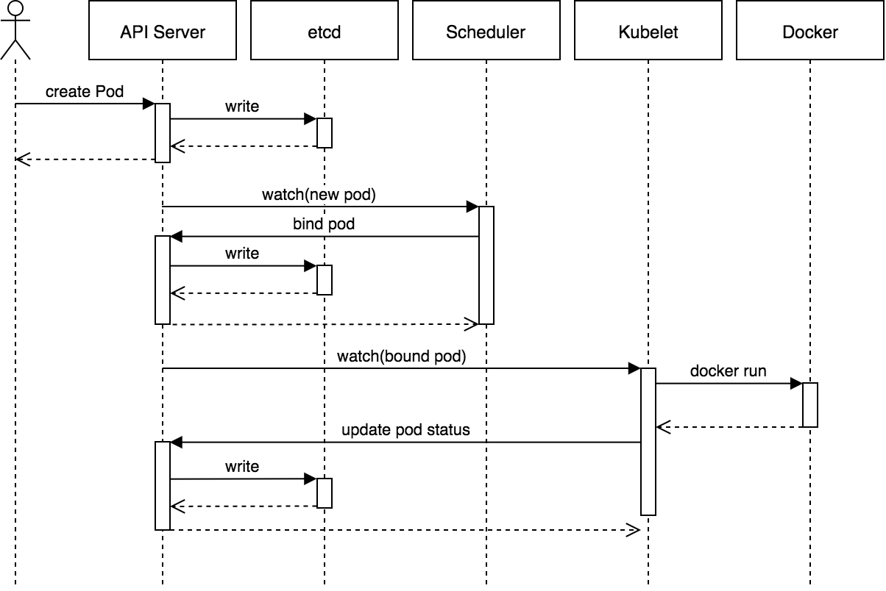
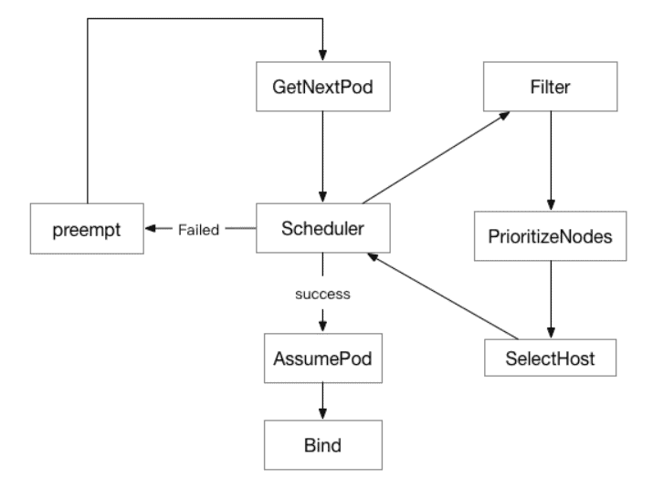

# Kubernetes Scheduler

## Scheduler 란?

- 스케줄러는 쿠버네티스에서 kubelet이 파드를 실행할 수 있도록 파드를 노드에 할당하는 역할을 수행한다.
- kube-scheduler는 쿠버네티스의 기본 스케줄러, 컨트롤 플레인의 일부로 실행
- 필요한경우 커스텀 스케줄러를 사용할 수 있다.

- 새로 생성된 모든 파드에 대해서 kube-schedluer는 최적의 노드를 선택한다. 
- 스케줄시 고려사항
  - 개별 및 집단 리소스 요구사항
  - 하드웨어/소프트웨어
  - 어피니티/안티어피니티
  - 테인트/톨러레이션
  - 데이터 지역성
  - 워크로드 간섭

## Scheduler 기본 동작 방식 

- 스케줄러의 기본 동작 방식은 아래와 같다. 
  


- 1. 사용자가 API Server에 Pod 생성을 요청한다. 
- 2. 요청된 Pod 생성을 etcd에 저장한다. 
- 3. Scheduler는 API Server를 확인하면서 새로 생성된 pod가 존재하는지 검사한다. 
- 4. 스케줄링이 완료되면 API Server에 해당 pod에 대해서 바인딩 요청을 한다. 
- 5. Kubelet은 API 서버에 주기적 요청을 수행하면서 Pod를 자신의 노드에 배치한다. 
- 6. 배차가 완료되면 kubelet은 container runtime을 통해서 컨테이너를 실행한다. 
- 7. kubelet은 실행된 pod의 상태를 주기적으로 API Server에 업데이트한다. 
- 8. API Server는 etcd에 쓰기를 수행한다.

## Pod 배치 단계

- Pod는 필터와 우선순위 2단계 작업에서 파드에 대한 노드 선택을 수행한다. 
- 필터와 스코어링이 끝나고 나면 우선순위가 가장 높은 노드에 파드를 할당하게 된다. 점수가 같다면 임의의 노드에 할당한다. 

### Filters

- 필터링 단계는 파드를 스케줄링 할 수 있는 노드 셋을 찾는다. 
- 기본적으로 스케줄러는 predicate 시리즈를 등록한다. 
- 포드에 필터를 적용하면 해당 포드는 지정된 조건을 충족하는 노드를 찾는다. 
- FeasibleNodes 메커니즘은 대규모 클러스터를 예약하기 위한 성능을 높일 수 있다. 

- 예) 1000개의 노드가 있고, 30%를 지정하면 스케줄러는 오직 필터링 프로세스에서 300개의 매치되는 노드만 찾게 된다. 
  - 300개의 매치되는 노드가 찾아지면 필터링 프로세스는 멈춘다. 
  - 이는 전체 노드를 검색하지 않고, 노드의 우선순위를 찾는데 시간을 절약한다. 
  - 그러나 Pod가 가장 적절한 노드로 예약되지 않을 수 있는 결함은 여전히 있따. 

### Prioritize (스코어링)

- 필터링 과정에서 선택된 노드들중 노드의 순위를 결정하여 가장 적합한 파드 배치를 선택한다. 
- Pod 우선순위는 조건을 충족하는 노드에 점수를 매기고 Pod에 가장 적합한 노드를 찾는 데 도움이 되는 방법이다. 
- Pod에 대한 스코어링을 제공하기 위해, Map 및 Reduce 인수가 PriorityConfig 파일에 사용된다. 
  - Map: 개별 노드의 점수를 계산한다. 
  - Reduce: 현재 PriorityConfig에 있는 모든 노드의 프로세스 점수를 다시 줄인다. 



image from: https://k21academy.com/docker-kubernetes/scheduling-in-kubernetes/

## Scheduler 메소드 

- 스케줄링을 통해서 노드를 선택하는 다양한 방법이 있다. 
- 아래 제시되는 여러 방법을 통해서 스케줄링을 조정할 수 있다. 

### Node Selector

- nodeSelector는 특정 노드에 스케줄링을 수행하는데 가장 단순한 방법이다. 
- nodeSelector는 PodSpec의 필드이며 기/값 쌍의 맵으로 지정된다. 
- 포드가 특정 노드에서 실행될 수 있으려면 노드는 pod에 대해서 사용된 키/값 쌍 레이블을 가지고 있어야한다. 
- 다음 명령을 통해서 노드에 레이블을 지정할 수 있다. 

#### Node에 레이블 지정 

```py
kubectl label nodes <node-name> gputype=T200
```

#### Pod 작성하기 

- 이제 위 노드 레이블에 pod를 직접 nodeSelector를 이용하여 할당하도록 매니페스트를 작성하자. 

```yaml
apiVersion: v1
kind: Pod
metadata: 
  name: nginx
  labels:
    env: test
spec:
  containers:
  - name: nginx
    image: nginx
    imagePullPolicy: IfNotPresent
  nodeSelector:
    gputype: T200
```

- 위 코드와 같이 nodeSelector에 key/value에 매치되는 노드를 선택한다. 

### Node Affinity/Anti-Affinity

- Node Affinity/Anti-Affinity 는 스케줄러에 의해서 어떤 노드가 선택될지에 대한 규칙을 수정하는 방법이다. 
- 이 기능은 nodeSelector의 일반화된 기능이다. 
- 룰들은 포드에 배치된 노드 및 선택기의 사용자 지정 레이블에 대한 친숙한 개념을 사용하여 정의된다. 
- 스케줄러에서 룰을 얼마나 엄격하게 적용할지에 따라 필수(required) 또는 선호(preferred) 규칙을 나타낼 수 있다. 

- Affinity에는 "노드 어피니티"와 "파드 간 어피니티/안티 어피니티" 2가지 종류가 있다. 
- 노드 어피니티: nodeSelector와 유사하지만 더 다양한 기능을 제공한다. 
- 파드 간 어피니티/안티 어피니티:  노드 레이블이 아닌 파드 레이블에 대해 제한을 적용한다. 

#### Node Affinity 

- nodeSelector와 개념적으로 유사 (노드 레이블을 기반으로 파드를 스케줄할 수 있도록 해준다.)
- 종류
  - requiredDuringSchedulingIgnoredDuringExecution
    - requiredDuringScheduling: 스케줄 되는 동안에 반드시 필수적으로 매치 되어야한다는 의미
    - IgnoredDuringExecution: 실행중에 노드의 레이블이 변경되더라도 그대로 실행된다는 의미 
  - preferredDuringSchedulingIgnoredDuringExecution
    - preferredDuringScheduling: 스케줄 되는 동안에 매치되면 좋고, 매치되지 않으면 다른곳에 실행되어도 무방의 의미
    - IgnoredDuringExecution: 실행중에 노드의 레이블이 변경되더라도 그대로 실행된다는 의미 

#### Sample

```yaml
apiVersion: v1
kind: Pod
metadata:
  name: with-node-affinity
spec:
  affinity:
    nodeAffinity:
      requiredDuringSchedulingIgnoredDuringExecution:
        nodeSelectorTerm:
        - matchExpressions:
          - kye: kubernetes.io/e2e-az-name
            operator: In
            values:
            - e2e-az1
            - e2e-az2
      preferredDuringSchedulingIgnoredDuringExecution:
      - weight: 1
        preference:
          matchExpressions:
          - key: another-node-label-key
            operator: In
            values:
            - another-node-label-value
  containers:
  - name: with-node-affinity
    image: k8s.gcr.io/pause:2.0
```

- 다음 조건이 만족하는 경우에만 배치가 됨 
  - key가 kubernetes.io/e2e-az-name 이고 값이 e2e-az1, e2e-az2 중 하나에 속하는 레이블이 있는 경우에만 파드 배치 가능 
  - 또한 위 조건을 충족하는 레이블의 노드 중에서 키가 another-node-lable-key 이고, another-node-label-value 인 레이블이 있는 노드를 선호하도록 한다. 
- 오퍼레이터 종류
  - In, NotIn, Exists, DoesNotExists, Gt, Lt 등이 있다. (NotIn, DoesNotExists) 을 이용하면 Anti-Affinity를 제공할 수 있다. 
- preferredDuringSchedulingIgnoredDuringExecution.weight: 값의 범위는 0 ~ 100이며, requiredDuringScheduling 어피니티에 대해서 누적 합계를 구한다. Pod는 값이 높은곳에 배치된다. 

#### Pod Affinity/Anti Affinity

- 노드의 레이블을 기반으로 하지 않고, 이미 실행중인 pod 레이블을 기반으로 파드가 스케줄 될 수 있는 노드를 제한 
- 노드와 다르게 Pod는 네임스페이스에 속하므로 파드 레이블 위의 세리블 셀렉터는 반드시 셀렉터가 적용될 네임스페이스를 지정해야한다. 

- 참고: 파드간 어피니티와 안티-어피니티에는 상당한 양의 프로세싱이 필요하므로 대규모 클러스터에서는 스케줄링 속도가 크게 느려질 수 있다. 클러스터 크기를 고려해야한다. 

- 종류
  - requiredDuringSchedulingIgnoredDuringExecution
    - requiredDuringScheduling: 스케줄 되는 동안에 반드시 필수적으로 매치 되어야한다는 의미
    - IgnoredDuringExecution: 실행중에 파드의 레이블이 변경되더라도 그대로 실행된다는 의미 
  - preferredDuringSchedulingIgnoredDuringExecution
    - preferredDuringScheduling: 스케줄 되는 동안에 매치되면 좋고, 매치되지 않으면 다른곳에 실행되어도 무방의 의미
    - IgnoredDuringExecution: 실행중에 파드의 레이블이 변경되더라도 그대로 실행된다는 의미 

- pod간 어피니티는 PodSpec에서 affinity 필드 중 podAffinity 필드로 지정한다. 

### Sample

```yaml
apiVersion: v1
kind: Pod
metadata:
  name: with-pod-affinity
spec:
  affinity:
    podAffinity:
      requiredDuringSchedulingIgnoredDuringExecution:
      - labelSelector:
          matchExpressions:
          - key: security
            operator: In
            values:
            - S1
        topologyKey: topology.kubernetes.io/zone
    podAntiAffinity:
      preferredDuringSchedulingIgnoredDuringExecution:
      - weight: 100
        podAffinityTerm:
          labelSelector:
            matchExpressions:
            - key: security
              operator: In
              values:
              - S2
          topologyKey: topology.kubernetes.io/zone
  containers:
  - name: with-pod-affinity
    image: k8s.gcr.io/pause:2.0
```

- 하나의 파드 어피니티 규칙과 하나의 파드 안티-어피니티 규칙을 정의하고 있다. 
- podAffinity:
  - requiredDuringSchedulingIgnoredDuringExecution
  - security와 값 S1인 레이블이 있는 하나 이상의 이미 실행중인 파드와 동일한 영역에 있는 경우에만 파드를 노드에 스케줄한 수 있다. 
- podAnitiAffinity:
  - preferredDuringSchedulingIgnoredDuringExecution
  - security와 값 S2인 레이블을 가진 파드와 동일한 영역의 노드에 스케줄 되지 않는다. 
- 연산자: In, NotIn, Exists, DoesNotExist 를 사용한다. 
- topologyKey는 적법한 어느 레이블-키도 될 수 있다. 하지만, 성능과 보안상의 이유로 topologyKey에는 몇가지 제약 조건이 있다. 
  - 파드 어피니티에서 requiredDuringSchedulingIgnoredDuringExecution 과 preferredDuringSchedulingIgnoredDuringExecution는 topologyKey의 빈 값을 허용하지 않는다. 
  - 파드 안티 어피니티에서 requiredDuringSchedulingIgnoredDuringExecution 과 preferredDuringSchedulingIgnoredDuringExecution는 topologyKey의 빈 값을 허용하지 않는다. 
  - requiredDuringSchedulingIgnoredDuringExecution 파드 안티-어피니티에서 topologyKey 를 kubernetes.io/hostname 로 제한하기 위해 어드미션 컨트롤러 LimitPodHardAntiAffinityTopology 가 도입되었다. 사용자 지정 토폴로지를 사용할 수 있도록 하려면, 어드미션 컨트롤러를 수정하거나 아니면 이를 비활성화해야 한다.
  - 위의 경우를 제외하고, topologyKey 는 적법한 어느 레이블-키도 가능하다.

### Taints and Tolerations

- Node Affinity는 노드셋을 가져와서 고를 수 있도록 하는 속성이라면, Taint는 노드가 Pod의 배치를 거부할 수 있다. 
- Toleration은 Pod에 적용하며, 테인트가 있어도 해당 노드에 스케줄 될 수 있도록 해준다. 
- 테인트와 톨러레이션은 함께 작동하며, 파드가 부적절한 노드에 스케줄 되지 않게 한다. 

#### Taint 걸기 

```py
kubectl taint nodes node1 key1=value1:NoSchedule
```

- node1에 테인트를 걸어준다. 
- 키/값 그리고 효과를 지정할 수 있다. 
  - 키: key1
  - 값: value1
  - 효과: NoSchedule
  - 즉, 해당 노드에는 스케줄될 수 없게 한다. 만약 toleration으로 key1:value1 이 설정된 Pod는 스케줄 될 수 있다. 

- 다음은 taint를 제거하는 방법이다. 

```py
kubectl taint nodes node1 key1=value1:NoSchedule-
```

- 끝에 '-' 를 추가하여 제거할 수 있다. 

```yaml
apiVersion: v1
kind: Pod
metadata:
  name: nginx
  labels:
    env: test
spec:
  containers:
  - name: nginx
    image: nginx
    imagePullPolicy: IfNotPresent
  tolerations:
  - key: "key1"
    operator: "Equal"
    value: "value1"
    effect: "NoSchedule"
```

- 노드에 걸었던 taint에 대해서 pod tolerations를 확인하고, 매치되는경우 해당 노드에 배포가 된다. 
- operator이 없다면 기본값은 "Equal" 이다. 
- operator이 "Exists"라면 value를 지정하지 않아야한다. (즉, 키와 이펙트가 존재하면으로 해석된다.)
- effect
  - NoSchedule: 이펙트가 있는 무시되지 않은 테인트가 하나 이상 있으면 쿠버네티스는 해당 노드에 파드를 스케줄 하지 않는다. 
  - NoSchedule: 이펙트가 있는 무시되지 않은 테인트가 없지만 PreferNoSchedule 이펙트가 있는 무시되지 않은 테인트가 하나 이상 있으면 쿠버네티스는 파드를 노드에 스케줄 하지 않으려고 시도한다.
  - NoExecute: 이펙트가 있는 무시되지 않은 테인트가 하나 이상 있으면 파드가 노드에서 축출되고(노드에 이미 실행중인 경우), 아직 실행되지 않았다면 스케줄 되지 않는다. 

### Taints/Toleration and Node Affinity

- Taints/Toleration 만 가지고서는 원하는 노드에 Pod를 정확히 배포하는 작업을 수행할 수 없다. 
  - Taint는 Node에 Pod가 배포되지 않도록 하는 기능이기 때문이다. 
  - 즉, Toleration을 걸어주면 Taint된 노드에 배포될 수 있다는 이미이며, Pod는 다른 노드에도 배포 될 수 있다. 
- Node Affinity 는 Pod가 배포될 노드의 조건을 지정하는 것이므로 원하는 노드에 pod를 배포할 수 있다. 
- Taints와 Node Affinity를 동시에 사용하면 배포되지 않아야할 노드를 지정하고, 배포해야하거나, 선호하는 노드에 pod를 배포할 수 있는 것이다. 

### 참고사항

- 현재 Kubernetes 스케줄러의 주요 스케줄링 방법은 Pod-By-Pod이다. 
- 이는 또한 현재 스케줄러의 단점 중 하나이며, 주요 성능 병목 현상은 다음과 같다. 
  - 쿠버네티스 스케줄러는 현재 전체 노드의 각 pod를 비교한다. pod 스케줄링은 클러스터가 커질수로 급격하게 느려진다. 
  - 현재 스케줄러는 확장성이 뛰어니자 않다. 몇가지 케이스에서 스케줄링은 하드코딩이 필요하다. 